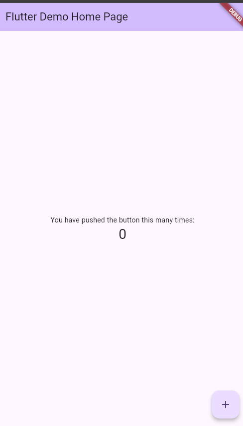
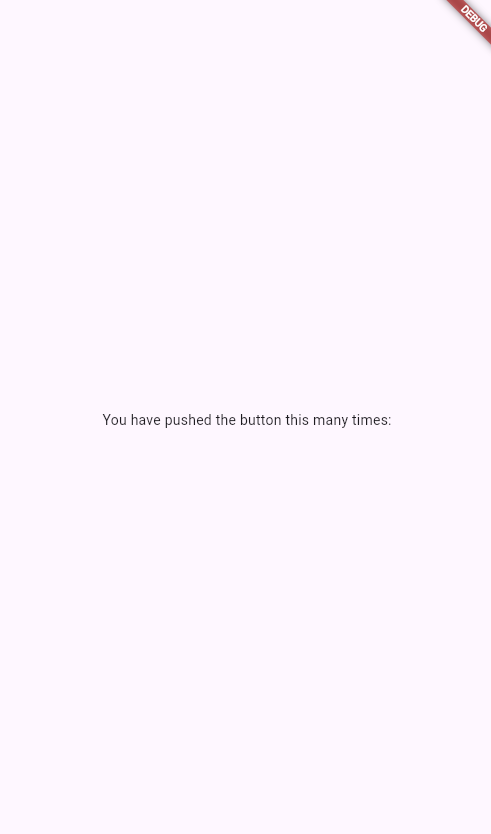
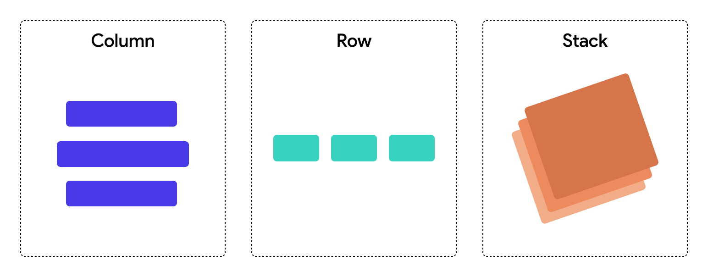
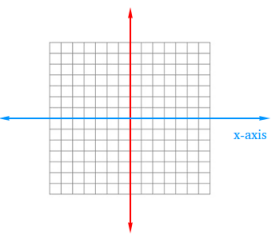
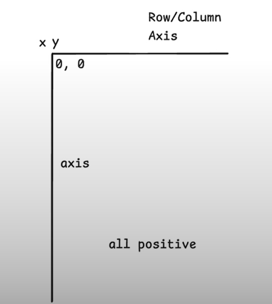
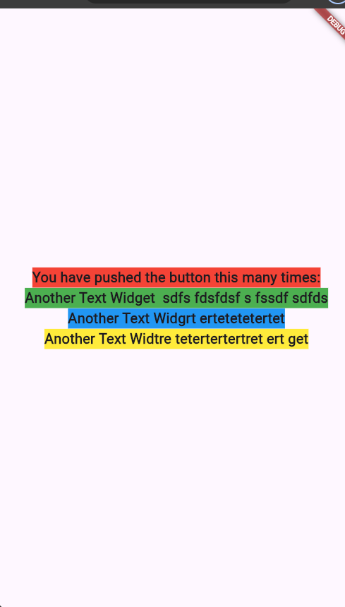
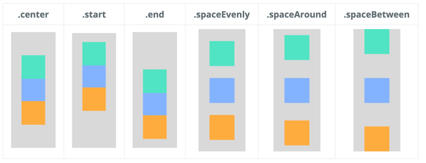
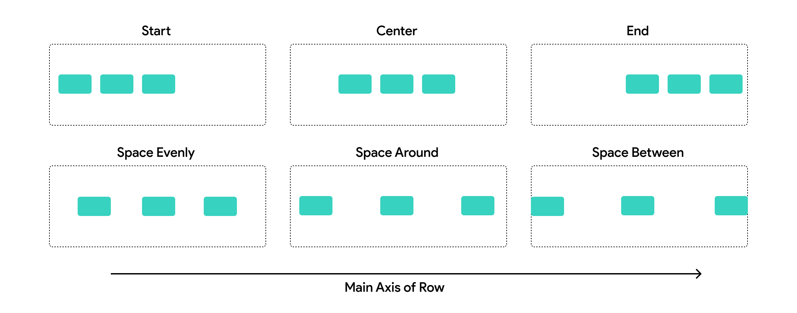

# Column, Row, and Stack: Mastering Widget Alignment in Flutter

## Step 1: Create a Basic App

First, we have to understand how flutter screen is rendered in the app. Let's create a basic app:

```shell
flutter create habit_tracker
```

Inside the folder of `lib` we have `main.dart`. Now let's run the app:

```shell
flutter run
```

You will see the following:



---

## Step 2: Clean Up the Code

Now let's remove all the comments and keep only the essential code:

```dart
import 'package:flutter/material.dart';

void main() {
  runApp(const MyApp());
}

class MyApp extends StatelessWidget {
  const MyApp({super.key});

  @override
  Widget build(BuildContext context) {
    return MaterialApp(
      title: 'Flutter Demo',
      theme: ThemeData(
        colorScheme: ColorScheme.fromSeed(seedColor: Colors.deepPurple),
      ),
      home: Scaffold(
        body: Center(
          child: Column(
            mainAxisAlignment: .center,
            children: [
              const Text('You have pushed the button this many times:'),
            ],
          ),
        ),
      ),
    );
  }
}
```

After refreshing, we can see:



---

## Step 3: Understanding the Question

Notice that the text is displayed **in the center** of the screen. But why? What makes this happen? Let's understand the key concepts:

---

## Step 4: Introduction to Column, Row, and Stack

Flutter uses layout widgets to organize child widgets. The three most important are:

### **Column** - Vertical Stacking

Column arranges widgets **vertically** one after another, from top to bottom.



Elements stack on top of each other like this:

- Widget 1
- Widget 2
- Widget 3

### **Row** - Horizontal Arrangement

Row arranges widgets **horizontally** side by side, from left to right:

- Widget 1 | Widget 2 | Widget 3

### **Stack** - Layering

Stack places widgets on top of one another, like layers:

- Widget 3 (on top)
- Widget 2 (middle)
- Widget 1 (bottom)

When building Flutter applications, you'll use these layout widgets constantly. Instead of copying and pasting single widgets, you'll combine multiple widgets using Column, Row, and Stack for better organization and appearance.

---

## Step 5: Understanding Axes in Flutter

To understand alignment, we need to understand **axes**. In mathematics, we think of 4 axes, but in Flutter, we use a coordinate system based on a screen:



Flutter's coordinate system works like the third quadrant in mathematics, but we consider the top-left corner as (0,0):



**Key concept**:

- **Main Axis**: The primary direction of the layout
  - For **Column**: Vertical (top to bottom)
  - For **Row**: Horizontal (left to right)
- **Cross Axis**: The secondary direction
  - For **Column**: Horizontal (left to right)
  - For **Row**: Vertical (top to bottom)

---

## Step 6: Practical Example - WITHOUT Alignment

Let's remove the `Center` widget and `mainAxisAlignment` from our code to see what happens:

```dart
home: Scaffold(
  body: Column(
    children: [
      Text('You have pushed the button this many times:'),
      Text('Another Text Widget'),
      Text('Another Text Widget'),
      Text('Another Text Widget'),
    ],
  ),
),
```

Notice what happens:


The text widgets are **aligned to the left side** of the screen! This is the default behavior of Column - it doesn't center content horizontally; it only arranges them vertically.

---

## Step 7: Understanding mainAxisAlignment

The `mainAxisAlignment` property controls how widgets are distributed along the **main axis**.

For a **Column**, since the main axis is vertical:

- `mainAxisAlignment` controls the **vertical positioning** of children
- It aligns all widgets from top to bottom

The key attributes are:

- `MainAxisAlignment.start` - Align at the beginning (top)
- `MainAxisAlignment.center` - Center along the axis
- `MainAxisAlignment.end` - Align at the end (bottom)
- `MainAxisAlignment.spaceAround` - Space around items
- `MainAxisAlignment.spaceBetween` - Space between items
- `MainAxisAlignment.spaceEvenly` - Equal space everywhere

---

## Step 8: Practical Example - WITH Alignment and Center

Now let's add back both the `Center` widget and `mainAxisAlignment`:

```dart
home: Scaffold(
  body: Center(
    child: Column(
      mainAxisAlignment: MainAxisAlignment.center,
      children: [
        Text(
          'You have pushed the button this many times:',
          style: TextStyle(
            backgroundColor: Colors.red,
            fontSize: 20,
            fontWeight: FontWeight.bold,
          ),
        ),
        Text('Another Text Widget'),
        Text('Another Text Widget'),
        Text('Another Text Widget'),
      ],
    ),
  ),
),
```

Now we see:



**What happened here:**

1. **`Center` widget** - Wraps the Column and centers it **horizontally** on the screen
2. **`mainAxisAlignment: MainAxisAlignment.center`** - Centers all children **vertically** within the Column

This is how you control positioning! By combining different alignment properties, you can position widgets exactly where you want them.

---

## Step 9: Column and Row Positioning Attributes

Here are all the available positioning attributes for Column and Row:



