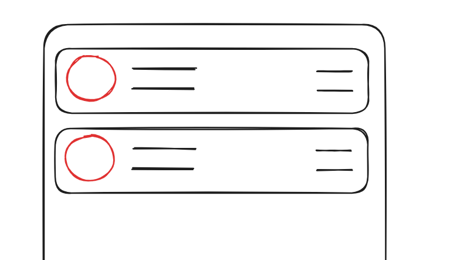
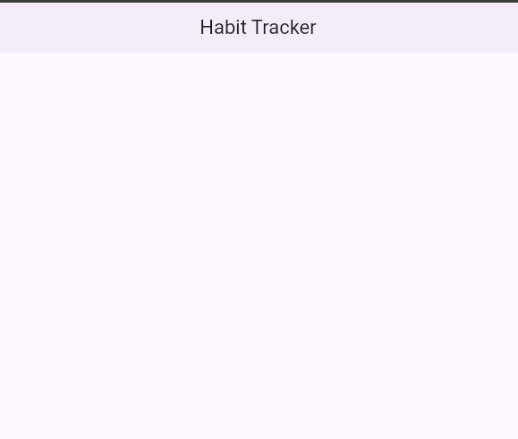
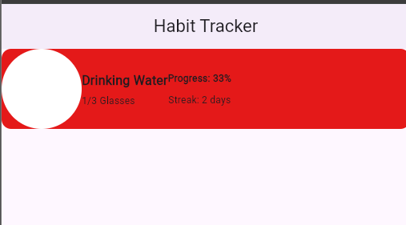
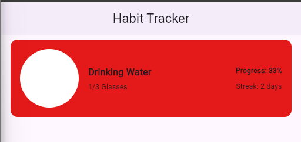
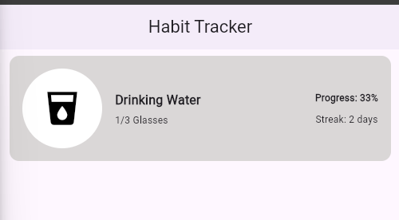
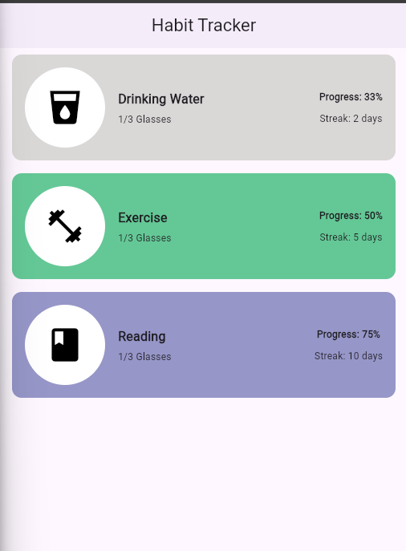

## Creating a Habit Tracker UI

We're going to build the following design:



### Understanding the Layout Structure

Before diving into code, let's break down how we'll structure this design. The best approach is to think about it hierarchically:

- Start with a main **Container** as the outer wrapper
- Inside, place a **Row** to handle horizontal layout
- The left side of the Row contains another **Row** with:
  - A circular **Container** (for the icon)
  - A **SizedBox** (for spacing)
  - A **Column** (for title and details)
- The right side is a **Column** (for progress info)

Here's the widget tree visualization:

```
Container
└── Row
    ├── Row
    │   ├── Container (circular icon)
    │   ├── SizedBox(width)
    │   └── Column
    │       ├── Text (title)
    │       └── Text (details)
    └── Column
        ├── Text (progress)
        └── Text (streak)
```

### Understanding StatelessWidget and the build() Method

Before we write code, let's understand a few key concepts:

**What is a StatelessWidget?**

- A `StatelessWidget` is a widget that doesn't change once it's created (immutable)
- It's used for UI elements that don't need to update based on user interaction or state changes
- Examples: Text, AppBar, Icon, etc.

**Why do we override the build() method?**

- The `build()` method tells Flutter **what to display on the screen**
- It returns a widget (or widget tree) that describes the UI
- Flutter calls this method automatically to render your widget

**What is BuildContext?**

- `BuildContext` is a reference to the location of a widget in the widget tree
- It gives you access to theme, navigation, and other parent widget information
- You pass it as a parameter because Flutter needs to know where to build the widget in the hierarchy

**Example in the MyApp class:**

```dart
class MyApp extends StatelessWidget {
  @override
  Widget build(BuildContext context) {
    // context = knows where MyApp sits in the widget tree
    // We return MaterialApp, which tells Flutter to display it
    return MaterialApp(
      home: Scaffold(...),
    );
  }
}
```

### Setting Up the App

Let's start with the basic app structure and AppBar:

```dart
import 'package:flutter/material.dart';

void main() {
  runApp(const MyApp());
}

class MyApp extends StatelessWidget {
  const MyApp({super.key});

  @override
  Widget build(BuildContext context) {
    return MaterialApp(
      debugShowCheckedModeBanner: false,
      title: 'Habit Tracker',
      home: Scaffold(
        appBar: AppBar(
          title: const Text("Habit Tracker"),
          centerTitle: true,
          elevation: 2,
        ),
      ),
    );
  }
}
```

Run the app and you'll see a simple screen with just the AppBar:



### Building the Habit Tile

Now let's add the main container and build out the tile structure. This is where the design starts to take shape:

```dart
body: Column(
  children: [
    Container(
      alignment: Alignment.center,
      decoration: BoxDecoration(
        borderRadius: BorderRadius.circular(12),
        color: const Color.fromARGB(255, 228, 25, 25),
      ),
      child: Row(
        children: [
          Row(
            children: [
              Container(
                height: 100,
                width: 100,
                decoration: BoxDecoration(
                  borderRadius: BorderRadius.circular(50),
                  color: Colors.white,
                ),
              ),
              Column(
                crossAxisAlignment: CrossAxisAlignment.start,
                children: [
                  const Text(
                    "Drinking Water",
                    style: TextStyle(
                      fontSize: 16,
                      fontWeight: FontWeight.bold,
                    ),
                  ),
                  const SizedBox(height: 5),
                  const Text("1/3 Glasses", style: TextStyle(fontSize: 12)),
                ],
              ),
            ],
          ),
          Column(
            children: [
              const Text(
                "Progress: 33%",
                style: TextStyle(
                  fontSize: 12,
                  fontWeight: FontWeight.bold,
                ),
              ),
              const SizedBox(height: 10),
              const Text("Streak: 2 days", style: TextStyle(fontSize: 12)),
            ],
          ),
        ],
      ),
    ),
  ],
),
```

Run it and you'll see all the pieces coming together, though it's not quite polished yet:



### Styling and Spacing

Right now the layout looks cramped and the spacing is off. Let's fix this by adding proper spacing, adjusting alignment, and improving the overall appearance.

Here's what we need to do:

1. Add margins and padding to the main container for breathing room
2. Use `spaceBetween` alignment so the progress info stays on the right
3. Add spacing between the icon and text with a SizedBox
4. Adjust the background color to something softer

```dart
body: Column(
  children: [
    Container(
      margin: const EdgeInsets.symmetric(horizontal: 16, vertical: 8),
      padding: const EdgeInsets.all(16),
      alignment: Alignment.center,
      decoration: BoxDecoration(
        borderRadius: BorderRadius.circular(12),
        color: const Color.fromARGB(255, 218, 215, 215),
      ),
      child: Row(
        mainAxisAlignment: MainAxisAlignment.spaceBetween,
        children: [
          Row(
            children: [
              Container(
                height: 100,
                width: 100,
                decoration: BoxDecoration(
                  borderRadius: BorderRadius.circular(50),
                  color: Colors.white,
                ),
              ),
              const SizedBox(width: 16),
              Column(
                crossAxisAlignment: CrossAxisAlignment.start,
                children: [
                  const Text(
                    "Drinking Water",
                    style: TextStyle(
                      fontSize: 16,
                      fontWeight: FontWeight.bold,
                    ),
                  ),
                  const SizedBox(height: 5),
                  const Text("1/3 Glasses", style: TextStyle(fontSize: 12)),
                ],
              ),
            ],
          ),
          Column(
            children: [
              const Text(
                "Progress: 33%",
                style: TextStyle(
                  fontSize: 12,
                  fontWeight: FontWeight.bold,
                ),
              ),
              const SizedBox(height: 10),
              const Text("Streak: 2 days", style: TextStyle(fontSize: 12)),
            ],
          ),
        ],
      ),
    ),
  ],
),
```

Much better! Now the spacing is correct and everything lines up nicely:



### Adding the Icon

Now let's add an icon to the circular container to make it more visually appealing. Update the white container's child property:

```dart
Container(
  height: 100,
  width: 100,
  decoration: BoxDecoration(
    borderRadius: BorderRadius.circular(50),
    color: Colors.white,
  ),
  child: const Icon(
    Icons.local_drink,
    color: Colors.black,
    size: 50,
  ),
),
```

Perfect! The tile now has a polished look with the icon inside the circular container:



### Creating a Reusable Custom Widget

Here's the key insight: our target design has multiple similar tiles. We _could_ copy and paste this code, but that's not ideal. Instead, let's create a reusable custom widget called `HabitTile`.

Extract all the tile code into a StatelessWidget and parameterize the values that change (habit name, progress, streak, icon, and color). This way, we can reuse the same widget multiple times with different data:

```dart
class HabitTile extends StatelessWidget {
  final String habitName;
  final String progress;
  final String streak;
  final IconData icon;
  final Color tileColor;

  const HabitTile({
    super.key,
    required this.habitName,
    required this.progress,
    required this.streak,
    required this.icon,
    required this.tileColor,
  });

  @override
  Widget build(BuildContext context) {
    return Container(
      margin: const EdgeInsets.all(16),
      alignment: Alignment.center,
      decoration: BoxDecoration(
        borderRadius: BorderRadius.circular(12),
        color: tileColor,
      ),
      child: Row(
        mainAxisAlignment: MainAxisAlignment.spaceBetween,
        children: [
          Row(
            children: [
              Container(
                height: 100,
                width: 100,
                decoration: BoxDecoration(
                  borderRadius: BorderRadius.circular(50),
                  color: Colors.white,
                ),
                child: Icon(icon, color: Colors.black, size: 50),
              ),
              const SizedBox(width: 16),
              Column(
                crossAxisAlignment: CrossAxisAlignment.start,
                children: [
                  Text(
                    habitName,
                    style: const TextStyle(fontSize: 16, fontWeight: FontWeight.bold),
                  ),
                  const SizedBox(height: 5),
                  const Text("1/3 Glasses", style: TextStyle(fontSize: 12)),
                ],
              ),
            ],
          ),
          Column(
            children: [
              Text(
                progress,
                style: const TextStyle(fontSize: 12, fontWeight: FontWeight.bold),
              ),
              const SizedBox(height: 10),
              Text(streak, style: const TextStyle(fontSize: 12)),
            ],
          ),
        ],
      ),
    );
  }
}
```

Now you can use this widget in your body like this:

```dart
body: Column(
  children: [
    HabitTile(
      habitName: "Drinking Water",
      progress: "Progress: 33%",
      streak: "Streak: 2 days",
      icon: Icons.local_drink,
      tileColor: const Color.fromARGB(255, 218, 215, 215),
    ),
    HabitTile(
      habitName: "Exercise",
      progress: "Progress: 50%",
      streak: "Streak: 5 days",
      icon: Icons.fitness_center,
      tileColor: const Color.fromARGB(255, 100, 200, 150),
    ),
    HabitTile(
      habitName: "Reading",
      progress: "Progress: 75%",
      streak: "Streak: 10 days",
      icon: Icons.book,
      tileColor: const Color.fromARGB(255, 150, 150, 200),
    ),
  ],
),
```

Here is the output:



This approach gives you several advantages:

- **Reusability**: Create as many tiles as you need with different data
- **Maintainability**: Update the design once, and it applies everywhere
- **Clarity**: The code is organized and easy to understand

Full Code:

```dart
import 'package:flutter/material.dart';

void main() {
  runApp(const MyApp());
}

class MyApp extends StatelessWidget {
  const MyApp({super.key});

  @override
  Widget build(BuildContext context) {
    return MaterialApp(
      debugShowCheckedModeBanner: false,
      title: 'Habit Tracker',
      home: Scaffold(
        appBar: AppBar(
          title: Text("Habit Tracker"),
          centerTitle: true,
          elevation: 2,
        ),
        body: Column(
          children: [
            HabitTile(
              habitName: "Drinking Water",
              progress: "Progress: 33%",
              streak: "Streak: 2 days",
              icon: Icons.local_drink,
              tileColor: const Color.fromARGB(255, 218, 215, 215),
            ),
            HabitTile(
              habitName: "Exercise",
              progress: "Progress: 50%",
              streak: "Streak: 5 days",
              icon: Icons.fitness_center,
              tileColor: const Color.fromARGB(255, 100, 200, 150),
            ),
            HabitTile(
              habitName: "Reading",
              progress: "Progress: 75%",
              streak: "Streak: 10 days",
              icon: Icons.book,
              tileColor: const Color.fromARGB(255, 150, 150, 200),
            ),
          ],
        ),
      ),
    );
  }
}

class HabitTile extends StatelessWidget {
  final String habitName;
  final String progress;
  final String streak;
  final IconData icon;
  final Color tileColor;

  const HabitTile({
    super.key,
    required this.habitName,
    required this.progress,
    required this.streak,
    required this.icon,
    required this.tileColor,
  });

  @override
  Widget build(BuildContext context) {
    return Container(
      margin: EdgeInsets.symmetric(horizontal: 16, vertical: 8),
      padding: EdgeInsets.all(16),
      alignment: Alignment.center,
      decoration: BoxDecoration(
        borderRadius: BorderRadius.circular(12),
        color: tileColor,
      ),
      child: Row(
        mainAxisAlignment: MainAxisAlignment.spaceBetween,
        children: [
          Row(
            children: [
              Container(
                height: 100,
                width: 100,
                decoration: BoxDecoration(
                  borderRadius: BorderRadius.circular(50),
                  color: Colors.white,
                ),
                child: Icon(icon, color: Colors.black, size: 50),
              ),
              SizedBox(width: 16),
              Column(
                crossAxisAlignment: CrossAxisAlignment.start,
                children: [
                  Text(
                    habitName,
                    style: TextStyle(fontSize: 16, fontWeight: FontWeight.bold),
                  ),
                  SizedBox(height: 5),
                  Text("1/3 Glasses", style: TextStyle(fontSize: 12)),
                ],
              ),
            ],
          ),
          Column(
            children: [
              Text(
                progress,
                style: TextStyle(fontSize: 12, fontWeight: FontWeight.bold),
              ),
              SizedBox(height: 10),
              Text(streak, style: TextStyle(fontSize: 12)),
            ],
          ),
        ],
      ),
    );
  }
}

```
