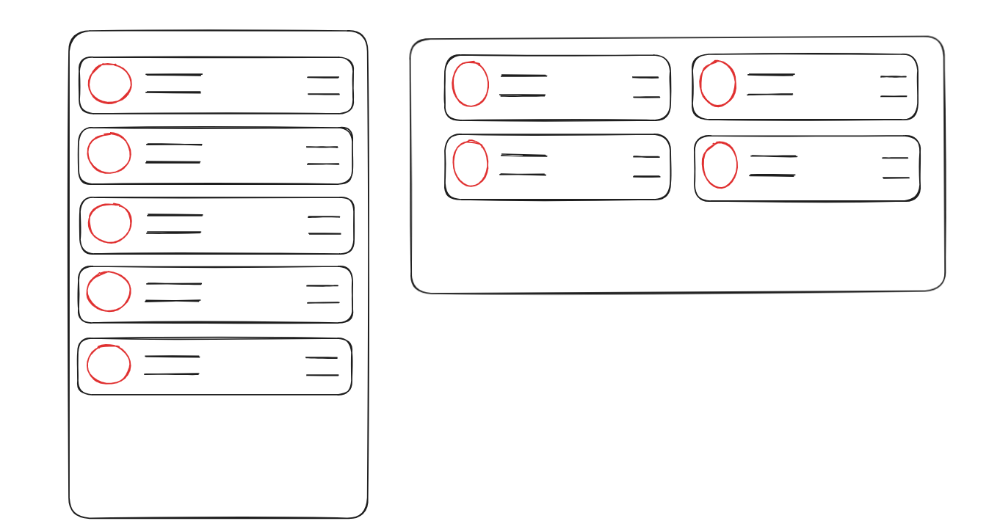
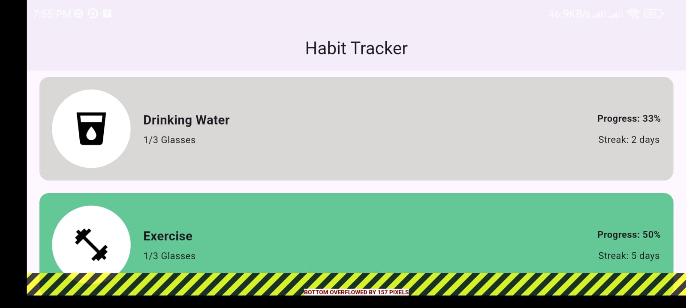
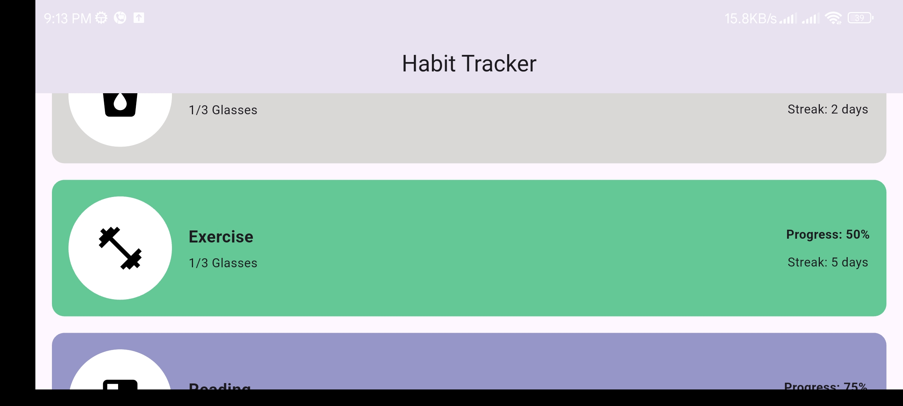
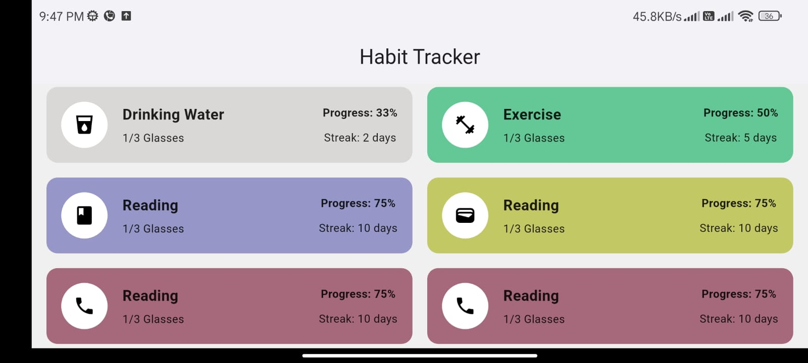
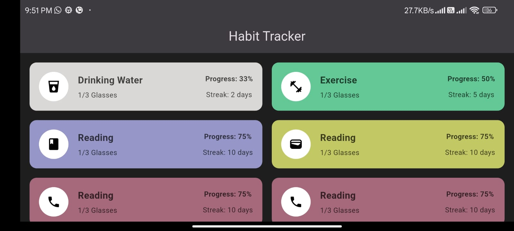

# Creating Responsive Design



## Problem

When you rotate the phone, the layout breaks. If we look at what we had before in the <a href="../2. Building Structure from Scratch/Readme.md">Tutorial</a>, when you tilt the phone sideways, everything just overflows:



## Solution 1: Add Scrolling with SingleChildScrollView

Wrap the Column with `SingleChildScrollView` to make content scrollable when it goes off-screen:

```dart
body: SingleChildScrollView(
    child: Column(
      children: [...]
    )
)
```

This works for both Column (vertical scroll) and Row (horizontal scroll):



But now there's still a problem - the layout looks cramped when you rotate the phone. Widgets are too big, text is everywhere.

## Solution 2: Different Layout for Portrait vs Landscape

Better approach: show widgets in a single column for portrait mode, but place them side-by-side in landscape mode.

To do this, we need to:

1. Store all widgets in a List instead of hardcoding them
2. Check the phone orientation
3. Arrange widgets differently based on orientation

### Step 1: Create a Widget List

Instead of copying widgets over and over, store them in a List:

```dart
class MyApp extends StatelessWidget {
  const MyApp({super.key});

  @override
  Widget build(BuildContext context) {
    final List<Widget> habitTiles = [
      HabitTile(
        habitName: "Drinking Water",
        progress: "Progress: 33%",
        streak: "Streak: 2 days",
        icon: Icons.local_drink,
        tileColor: const Color.fromARGB(255, 218, 215, 215),
      ),
      HabitTile(
        habitName: "Exercise",
        progress: "Progress: 50%",
        streak: "Streak: 5 days",
        icon: Icons.fitness_center,
        tileColor: const Color.fromARGB(255, 100, 200, 150),
      ),
      // ... more widgets
    ];

    return MaterialApp(
      // ... rest of code
    );
  }
}
```

Instead of hardcoding each widget, we now have a `habitTiles` list that holds everything.

### Step 2: Check Orientation with MediaQuery

Get the phone orientation at the start of your build method:

```dart
final isPortrait = MediaQuery.orientationOf(context) == Orientation.portrait;
```

Then in your Column, use `if` statements with the spread operator (`...`) to conditionally show layouts:

```dart
child: Column(
  spacing: 16,
  children: [
    // Portrait mode: show all widgets in a single column
    if (isPortrait) ...habitTiles,

    // Landscape mode: show 2 widgets side-by-side
    if (!isPortrait) ...[
      for (var i = 0; i < habitTiles.length; i += 2)
        Row(
          spacing: 16,
          children: [
            Expanded(child: habitTiles[i]),
            if (i + 1 < habitTiles.length)
              Expanded(child: habitTiles[i + 1]),
          ],
        ),
    ],
  ],
)
```

What's happening here:

- `if (isPortrait) ...habitTiles` - spreads all widgets as individual items in the Column
- `if (!isPortrait) ...[]` - creates pairs of widgets in Rows for landscape mode
- The `...` spread operator unpacks the list into separate children

### Why This Approach is Cleaner

Instead of using `OrientationBuilder` (which adds an extra widget layer), we can check the orientation directly in the Column:

- Gets orientation once with `MediaQuery.orientationOf(context)`
- Uses `if` conditions with spread operator to conditionally render layouts
- Simpler and more readable than nested builders
- No extra widget nesting

Result:



## Solution 3: Better Approach - Separate Layouts with Builders (Recommended)

The previous solution works, but can be memory-inefficient for larger lists because it renders all widgets at once. A better approach is to:

1. **Separate portrait and landscape into different layout widgets** - Makes code cleaner and easier to maintain
2. **Use `ListView.builder` for portrait** - Only renders visible items, saves memory
3. **Use `GridView.builder` for landscape** - Perfect for grid layouts, lazy-loads items

### Why This is Better:

- **Memory Efficient**: Builders only render items that are visible on screen (lazy loading)
- **Better Performance**: Scrolling is smoother because fewer widgets are in the widget tree
- **Scalable**: If you add 100+ items, the app won't slow down
- **Cleaner Code**: Separates portrait and landscape logic into dedicated widgets
- **Lazy Loading**: As user scrolls, new items are built only when needed

### Step 1: Create Separate Layout Widgets

Instead of using conditional logic in a Column, create dedicated widgets for each orientation:

```dart
class PotraitLayout extends StatelessWidget {
  final List<Widget> habitTiles;

  const PotraitLayout(this.habitTiles, {super.key});

  @override
  Widget build(BuildContext context) {
    return ListView.builder(
      padding: const EdgeInsets.all(16.0),
      itemBuilder: (context, index) {
        return Padding(
          padding: const EdgeInsets.only(bottom: 8.0),
          child: habitTiles[index],
        );
      },
      itemCount: habitTiles.length,
    );
  }
}

class LandscapeLayout extends StatelessWidget {
  final List<Widget> habitTiles;

  const LandscapeLayout(this.habitTiles, {super.key});

  @override
  Widget build(BuildContext context) {
    final cardwidth = MediaQuery.of(context).size.width / 2 - 32;
    return GridView.builder(
      padding: const EdgeInsets.all(16.0),
      gridDelegate: SliverGridDelegateWithFixedCrossAxisCount(
        crossAxisCount: 2,
        childAspectRatio: cardwidth / 100,
        mainAxisSpacing: 16,
        crossAxisSpacing: 16,
      ),
      itemCount: habitTiles.length,
      itemBuilder: (context, index) {
        return habitTiles[index];
      },
    );
  }
}
```

### Step 2: Check Orientation and Return Appropriate Layout

In your main build method, check the orientation and return the correct layout:

```dart
final isLandscape = MediaQuery.of(context).orientation == Orientation.landscape;

return MaterialApp(
  // ... theme setup ...
  home: Scaffold(
    appBar: AppBar(title: Text("Habit Tracker")),
    body: SafeArea(
      bottom: false,
      child: isLandscape
          ? LandscapeLayout(habitTiles)
          : PotraitLayout(habitTiles),
    ),
  ),
);
```

### Key Improvements:

| Feature        | Old Approach                | New Approach                      |
| -------------- | --------------------------- | --------------------------------- |
| Memory Usage   | Renders all items at once   | Only visible items (lazy loading) |
| Scrolling      | Can be slow with many items | Smooth scrolling                  |
| Code Structure | Mixed in one Column         | Separated into clear widgets      |
| Scalability    | Poor for 100+ items         | Excellent for any number          |

## Step 3: Add Dark Mode

Lastly, add nice dark mode support with `darkTheme`:

```dart
return MaterialApp(
  debugShowCheckedModeBanner: false,
  title: 'Habit Tracker',
  theme: ThemeData(
    colorScheme: ColorScheme.fromSeed(seedColor: Colors.deepPurple),
    scaffoldBackgroundColor: const Color.fromARGB(255, 240, 240, 240),
    appBarTheme: AppBarTheme(
      centerTitle: true,
      elevation: 2,
      backgroundColor: Colors.white,
    ),
    textTheme: TextTheme(bodyMedium: TextStyle(color: Colors.black87)),
  ),
  darkTheme: ThemeData.dark().copyWith(
    scaffoldBackgroundColor: const Color.fromARGB(255, 30, 30, 30),
    appBarTheme: AppBarTheme(
      centerTitle: true,
      elevation: 2,
      backgroundColor: const Color.fromARGB(255, 50, 50, 50),
    ),
    textTheme: TextTheme(
      bodyMedium: TextStyle(color: const Color.fromARGB(179, 0, 0, 0)),
    ),
  ),
  // ...
);
```

The `darkTheme` parameter defines colors specifically for dark mode. When you turn on dark mode on your phone, these colors will be used instead of the regular theme.



## Complete Code

```dart
import 'package:flutter/material.dart';

void main() {
  runApp(const MyApp());
}

class MyApp extends StatelessWidget {
  const MyApp({super.key});

  @override
  Widget build(BuildContext context) {
    final List<Widget> habitTiles = [
      HabitTile(
        habitName: "Drinking Water",
        progress: "Progress: 33%",
        streak: "Streak: 2 days",
        icon: Icons.local_drink,
        tileColor: const Color.fromARGB(255, 218, 215, 215),
      ),
      HabitTile(
        habitName: "Exercise",
        progress: "Progress: 50%",
        streak: "Streak: 5 days",
        icon: Icons.fitness_center,
        tileColor: const Color.fromARGB(255, 100, 200, 150),
      ),
      HabitTile(
        habitName: "Reading",
        progress: "Progress: 75%",
        streak: "Streak: 10 days",
        icon: Icons.book,
        tileColor: const Color.fromARGB(255, 150, 150, 200),
      ),
      HabitTile(
        habitName: "Saving Money",
        progress: "Progress: 75%",
        streak: "Streak: 10 days",
        icon: Icons.wallet,
        tileColor: const Color.fromARGB(255, 193, 200, 100),
      ),
      HabitTile(
        habitName: "Meditation",
        progress: "Progress: 75%",
        streak: "Streak: 10 days",
        icon: Icons.phone,
        tileColor: const Color.fromARGB(255, 165, 105, 123),
      ),
    ];

    final isLandscape =
        MediaQuery.of(context).orientation == Orientation.landscape;

    return MaterialApp(
      debugShowCheckedModeBanner: false,
      title: 'Habit Tracker',
      theme: ThemeData(
        colorScheme: ColorScheme.fromSeed(seedColor: Colors.deepPurple),
        scaffoldBackgroundColor: const Color.fromARGB(255, 240, 240, 240),
        appBarTheme: AppBarTheme(
          centerTitle: true,
          elevation: 2,
          backgroundColor: Colors.white,
        ),
        textTheme: TextTheme(bodyMedium: TextStyle(color: Colors.black87)),
      ),
      darkTheme: ThemeData.dark().copyWith(
        scaffoldBackgroundColor: const Color.fromARGB(255, 30, 30, 30),
        appBarTheme: AppBarTheme(
          centerTitle: true,
          elevation: 2,
          backgroundColor: const Color.fromARGB(255, 50, 50, 50),
        ),
        textTheme: TextTheme(
          bodyMedium: TextStyle(color: const Color.fromARGB(179, 0, 0, 0)),
        ),
      ),
      home: Scaffold(
        appBar: AppBar(title: Text("Habit Tracker")),
        body: SafeArea(
          bottom: false,
          child: isLandscape
              ? LandscapeLayout(habitTiles)
              : PotraitLayout(habitTiles),
        ),
      ),
    );
  }
}

class PotraitLayout extends StatelessWidget {
  final List<Widget> habitTiles;

  const PotraitLayout(this.habitTiles, {super.key});

  @override
  Widget build(BuildContext context) {
    return ListView.builder(
      padding: const EdgeInsets.all(16.0),
      itemBuilder: (context, index) {
        return Padding(
          padding: const EdgeInsets.only(bottom: 8.0),
          child: habitTiles[index],
        );
      },
      itemCount: habitTiles.length,
    );
  }
}

class LandscapeLayout extends StatelessWidget {
  final List<Widget> habitTiles;

  const LandscapeLayout(this.habitTiles, {super.key});

  @override
  Widget build(BuildContext context) {
    final cardwidth = MediaQuery.of(context).size.width / 2 - 32;
    return GridView.builder(
      padding: const EdgeInsets.all(16.0),
      gridDelegate: SliverGridDelegateWithFixedCrossAxisCount(
        crossAxisCount: 2,
        childAspectRatio: cardwidth / 100,
        mainAxisSpacing: 16,
        crossAxisSpacing: 16,
      ),
      itemCount: habitTiles.length,
      itemBuilder: (context, index) {
        return habitTiles[index];
      },
    );
  }
}

class HabitTile extends StatelessWidget {
  final String habitName;
  final String progress;
  final String streak;
  final IconData icon;
  final Color tileColor;

  const HabitTile({
    super.key,
    required this.habitName,
    required this.progress,
    required this.streak,
    required this.icon,
    required this.tileColor,
  });

  @override
  Widget build(BuildContext context) {
    return Card(
      color: tileColor,
      shape: RoundedRectangleBorder(borderRadius: BorderRadius.circular(12)),
      child: Padding(
        padding: const EdgeInsets.all(8.0),
        child: Row(
          mainAxisAlignment: MainAxisAlignment.spaceBetween,
          children: [
            Row(
              children: [
                Container(
                  height: 50,
                  width: 50,
                  decoration: BoxDecoration(
                    borderRadius: BorderRadius.circular(50),
                    color: Colors.white,
                  ),
                  child: Icon(icon, color: Colors.black),
                ),
                SizedBox(width: 16),
                Column(
                  crossAxisAlignment: CrossAxisAlignment.start,
                  children: [
                    Text(
                      habitName,
                      style: TextStyle(fontSize: 16, fontWeight: FontWeight.bold),
                    ),
                    SizedBox(height: 5),
                    Text("1/3 Glasses", style: TextStyle(fontSize: 12)),
                  ],
                ),
              ],
            ),
            Column(
              children: [
                Text(
                  progress,
                  style: TextStyle(fontSize: 12, fontWeight: FontWeight.bold),
                ),
                SizedBox(height: 10),
                Text(streak, style: TextStyle(fontSize: 12)),
              ],
            ),
          ],
        ),
      ),
    );
  }
}
```
