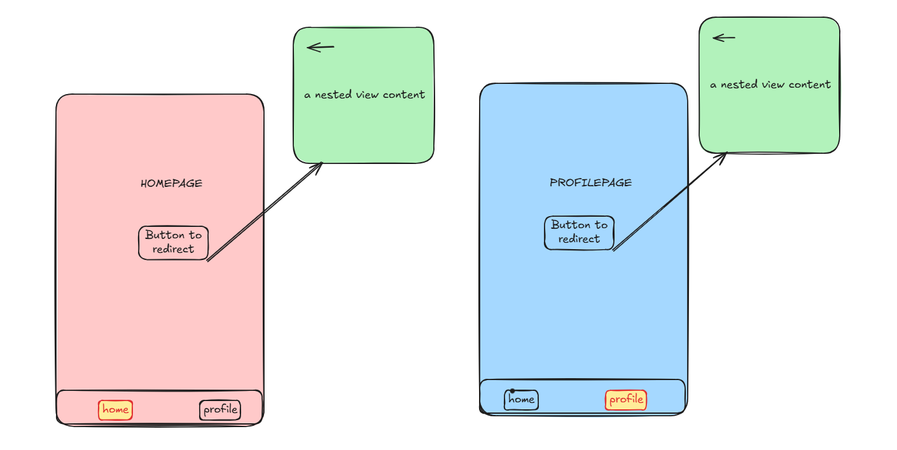

# Navigation with Go Router


## Introduction: From Navigator to Go Router

When I first learned Flutter, navigation was simple but chaotic. You'd write code like this everywhere:

```dart
// OLD WAY - Navigator
Navigator.of(context).push(
  MaterialPageRoute(builder: (context) => const ProfileScreen()),
);
```

The problem? **This code is everywhere** in your app. Every button does the same thing. Every screen imports other screens. Routes are scattered across dozens of files. If you want to change how navigation works or add animations, you're rewriting code in 50 places.

Go Router **fixes this entire problem** by centralizing all navigation into one file. Instead of thinking about screens, you think about **route names**. One line of code:

```dart
// NEW WAY - Go Router
context.goNamed('profile');
```

That's it. The routes, the logic, the transitions—all defined once in `routes.dart`. Let me show you why this matters.

---

## The Problem We're Solving

### Without Go Router (The Old Way)

Imagine building a tab-based app with Home and Profile screens. In the old Navigator world:

**HomeScreen:**

```dart
class HomeScreen extends StatelessWidget {
  @override
  Widget build(BuildContext context) {
    return Scaffold(
      body: ElevatedButton(
        onPressed: () {
          Navigator.of(context).push(
            MaterialPageRoute(builder: (context) => const ProfileScreen()),
          );
        },
        child: const Text('Go to Profile'),
      ),
      bottomNavigationBar: BottomNavigationBar(
        onTap: (index) {
          if (index == 1) {
            Navigator.of(context).push(
              MaterialPageRoute(builder: (context) => const ProfileScreen()),
            );
          }
        },
      ),
    );
  }
}
```

**ProfileScreen:**

```dart
class ProfileScreen extends StatelessWidget {
  @override
  Widget build(BuildContext context) {
    return Scaffold(
      body: ElevatedButton(
        onPressed: () {
          Navigator.of(context).push(
            MaterialPageRoute(builder: (context) => const SampleScreen()),
          );
        },
        child: const Text('Go to Sample'),
      ),
      bottomNavigationBar: BottomNavigationBar(
        onTap: (index) {
          if (index == 0) {
            Navigator.of(context).push(
              MaterialPageRoute(builder: (context) => const HomeScreen()),
            );
          }
        },
      ),
    );
  }
}
```

**Problems with this approach:**

1. **Repetition** - `Navigator.of(context).push(MaterialPageRoute(...))` written 20+ times
2. **Imports scattered** - Every screen imports every other screen it can navigate to
3. **Inconsistent behavior** - One person pushes, another pops, another replaces the stack
4. **Hard to maintain** - Want to add an animation? Change 20 files
5. **Navigation logic is in UI** - Your beautiful UI code is mixed with routing logic
6. **Memory leaks** - Old screens keep stacking up in memory
7. **Inconsistent bottom nav** - Each screen has its own bottom nav logic, sometimes they don't match

### With Go Router (The Solution)

```dart
// ONE FILE defines everything
context.goNamed('profile');
```

That's literally all you write in your screens. The entire routing logic is **centralized, consistent, and maintainable**.

Create `lib/routes.dart`:

```dart
import "package:go_router/go_router.dart";
import "screens/homepage.dart";
import "screens/profile.dart";

final GoRouter router = GoRouter(
  debugLogDiagnostics: true, // Shows routing logs in console
  routes: [
    GoRoute(
      path: '/',              // URL path (for deep linking)
      name: 'home',           // Named identifier (use this in navigation)
      builder: (context, state) => const HomeScreen(),
      routes: [               // Nested routes (child screens)
        GoRoute(
          path: 'home-sample',
          name: 'home-sample',
          builder: (context, state) => const HomePageSampleView(),
        ),
      ],
    ),
    GoRoute(
      path: '/profile',
      name: 'profile',
      builder: (context, state) => const ProfileScreen(),
      routes: [
        GoRoute(
          path: 'sample',
          name: 'profile-sample',
          builder: (context, state) => const SampleViewInsideScaffold(),
        ),
      ],
    ),
  ],
);
```

**Understanding the parameters:**

- **`path`**: The URL path for deep linking. Example: `'/'` means root, `'/profile'` means `/profile` URL. Nested routes combine: `'home-sample'` under `'/'` becomes `/home-sample`
- **`name`**: The identifier you use in `context.goNamed('profile')`. Think of it as a constant string that won't change
- **`builder`**: A function that returns the Widget to display. Gets `context` and `state` (for route parameters)
- **`routes`**: Child routes nested under this parent. If you're on the Home screen, its children are Home's nested screens

### Step 2: Connect to MaterialApp

Update `lib/main.dart`:

```dart
void main() {
  runApp(const MyApp());
}

class MyApp extends StatelessWidget {
  const MyApp({super.key});

  @override
  Widget build(BuildContext context) {
    return MaterialApp.router(  // Use .router() not default constructor
      debugShowCheckedModeBanner: false,
      title: 'Flutter Routing Demo',
      theme: ThemeData(primarySwatch: Colors.blue),
      routerConfig: router,     // Pass your router config
    );
  }
}
```

**Why `MaterialApp.router()` instead of `MaterialApp()`?**

- `MaterialApp()` uses `home` parameter and traditional Navigator stack
- `MaterialApp.router()` tells Flutter "I'm managing routing with Go Router, not the default Navigator"
- This lets Go Router control the entire navigation system

---

## Navigation Methods Explained with Intuition

Now comes the critical part: **understanding when to use which navigation method**. This is where most people get confused.

### Concept: The Stack

Think of navigation like a **stack of plates**:

```
┌─────────────────┐
│  SampleScreen   │  ← Current screen (top of stack)
├─────────────────┤
│  ProfileScreen  │
├─────────────────┤
│  HomeScreen     │  ← Bottom of stack
└─────────────────┘
```

When you tap "back", you remove the top plate (SampleScreen), revealing ProfileScreen underneath.

### Method 1: `context.goNamed('name')` - REPLACE Top Plate

```dart
context.goNamed('profile');
```

**What it does:**

- Takes the top plate (current screen) and **replaces it entirely** with a new plate
- Does NOT keep history
- Old screen is disposed from memory

**Stack before:**

```
┌──────────────┐
│  HomeScreen  │
└──────────────┘
```

**Stack after `context.goNamed('profile')`:**

```
┌──────────────┐
│ ProfileScreen│  ← Replaced, not added
└──────────────┘
```

**Memory usage:** Lower - old screen is thrown away
**Back button:** Won't work (no previous screen in stack)
**Use when:** Navigating between main tabs or top-level screens

**Real example from our app:**

```dart
// In BottomNavBar
if (index == 0) {
  context.goNamed('home');      // Replace entire stack with home
} else if (index == 1) {
  context.goNamed('profile');   // Replace entire stack with profile
}
```

Why? Because when you tap the "Profile" tab, you don't want to **add** another profile screen to the stack. You want to **show** the profile screen, disposing everything else.

### Method 2: `context.pushNamed('name')` - ADD New Plate

```dart
context.pushNamed('home-sample');
```

**What it does:**

- **Adds** a new plate on top without removing anything
- Keeps the previous screen in memory
- Back button works - user can go back

**Stack before:**

```
┌──────────────┐
│  HomeScreen  │
└──────────────┘
```

**Stack after `context.pushNamed('home-sample')`:**

```
┌──────────────────────┐
│ HomePageSampleView   │  ← Added on top
├──────────────────────┤
│     HomeScreen       │  ← Still in memory, can go back to it
└──────────────────────┘
```

**Memory usage:** Higher - keeps HomeScreen in memory
**Back button:** Works perfectly - goes back to HomeScreen
**Use when:** Going to detail/nested screens where you want a back button

**Real example from our app:**

```dart
// In HomeScreen, tapping "Go to Details"
onPressed: () {
  context.goNamed('home-sample');  // We used goNamed, but could use pushNamed:
}
```

Actually, we used `goNamed()` because we don't need a back button from the sample screen. But if we DID want a back button, we'd use `pushNamed()`.

### Method 3: `context.pop()` - Remove Top Plate

```dart
context.pop();
```

**What it does:**

- Removes the current screen from the stack
- Reveals the previous screen underneath
- Only works if there IS a screen underneath

**Stack before:**

```
┌──────────────────────┐
│ HomePageSampleView   │
├──────────────────────┤
│     HomeScreen       │
└──────────────────────┘
```

**Stack after `context.pop()`:**

```
┌──────────────┐
│  HomeScreen  │
└──────────────┘
```

**When to use:** "Go Back" buttons, device back button handling

---

## Why We Use a Separate BottomNavBar Widget

This is crucial for understanding app architecture. Let me show you why:

### Without Reusable NavBar (Bad)

If you put the navigation logic directly in each screen:

```dart
// HomeScreen
BottomNavigationBar(
  onTap: (index) {
    if (index == 0) context.goNamed('home');
    else if (index == 1) context.goNamed('profile');
  },
)

// ProfileScreen
BottomNavigationBar(
  onTap: (index) {
    if (index == 0) context.goNamed('home');
    else if (index == 1) context.goNamed('profile');
  },
)

// SampleScreen inside Profile
BottomNavigationBar(
  onTap: (index) {
    if (index == 0) context.goNamed('home');
    else if (index == 1) context.goNamed('profile');
  },
)
```

**Problems:**

```
┌─────────────────────────────────────┐
│ Navigation logic repeated 3x times  │
│ Hard to change (edit 3 places)      │
│ Easy to have bugs (typos)           │
│ Inconsistent highlighting           │
└─────────────────────────────────────┘
```

### With Reusable NavBar (Good)

Create `lib/widgets/bottom_navbar.dart`:

```dart
class BottomNavBar extends StatelessWidget {
  final int currentIndex;  // Which tab is highlighted

  const BottomNavBar({required this.currentIndex});

  @override
  Widget build(BuildContext context) {
    return BottomNavigationBar(
      currentIndex: currentIndex,  // Highlights the active tab
      items: const [
        BottomNavigationBarItem(icon: Icon(Icons.home), label: 'Home'),
        BottomNavigationBarItem(icon: Icon(Icons.person), label: 'Profile'),
      ],
      onTap: (index) {
        if (index == 0) context.goNamed('home');
        else if (index == 1) context.goNamed('profile');
      },
    );
  }
}
```

Now use it everywhere:

```dart
// HomeScreen
BottomNavBar(currentIndex: 0)

// ProfileScreen
BottomNavBar(currentIndex: 1)

// SampleScreen inside Profile
BottomNavBar(currentIndex: 1)  // Still shows Profile tab highlighted
```

**Benefits:**

```
┌──────────────────────────────────────────┐
│ Navigation logic in ONE place            │
│ currentIndex parameter keeps highlighting│
│ Consistent UI everywhere                 │
│ Change behavior in 1 file               │
│ Bug fixes apply everywhere automatically │
└──────────────────────────────────────────┘
```

**Visual comparison:**

```
WITHOUT Reusable NavBar          WITH Reusable NavBar
┌──────────────────┐             ┌─────────────────────┐
│  HomeScreen      │             │    HomeScreen       │
│  ┌──────────────┐│             │  ┌───────────────┐  │
│  │ Navigation   ││  ── X ──    │  │ const NavBar  │  │
│  │ Logic here   ││             │  │ (currentIdx:0)│  │
│  └──────────────┘│             │  └───────────────┘  │
└──────────────────┘             └─────────────────────┘
        ↓                                 ↓
┌──────────────────┐             ┌─────────────────────┐
│  ProfileScreen   │             │   ProfileScreen     │
│  ┌──────────────┐│             │  ┌───────────────┐  │
│  │ Navigation   ││  ── X ──    │  │ const NavBar  │  │
│  │ Logic here   ││             │  │ (currentIdx:1)│  │
│  │ (DUPLICATED) ││             │  └───────────────┘  │
│  └──────────────┘│             └─────────────────────┘
└──────────────────┘                    ↓
        ↓                        ┌─────────────────────┐
┌──────────────────┐             │ bottom_navbar.dart  │
│  SampleScreen    │             │  (Single source of  │
│  ┌──────────────┐│             │   truth)            │
│  │ Navigation   ││  ──X──      └─────────────────────┘
│  │ Logic here   ││
│  │ (DUPLICATED) ││
│  └──────────────┘│
└──────────────────┘
```

---

## Why We Use Nested Go Router

Now let's understand why nested routes matter:

### Without Nested Routes (Flat Structure)

```dart
final GoRouter router = GoRouter(
  routes: [
    GoRoute(path: '/', name: 'home', builder: ..., const HomeScreen()),
    GoRoute(path: '/home-sample', name: 'home-sample', builder: ..., const HomePageSampleView()),
    GoRoute(path: '/profile', name: 'profile', builder: ..., const ProfileScreen()),
    GoRoute(path: '/profile-sample', name: 'profile-sample', builder: ..., const SampleViewInsideScaffold()),
  ],
);
```

**Problems:**

```
Routes appear as a FLAT list with no relationship:
/
/home-sample     ← What's the relationship to /? Unclear!
/profile
/profile-sample  ← What's the relationship to /profile? Unclear!
```

- No parent-child relationship
- Hard to understand the app structure
- If you delete `/profile`, nobody knows `/profile-sample` is now orphaned
- When you navigate away from profile, the sample view might still exist somewhere

### With Nested Routes (Hierarchical Structure)

```dart
final GoRouter router = GoRouter(
  routes: [
    GoRoute(
      path: '/',
      name: 'home',
      builder: (context, state) => const HomeScreen(),
      routes: [                           // ← Nested routes
        GoRoute(
          path: 'home-sample',
          name: 'home-sample',
          builder: (context, state) => const HomePageSampleView(),
        ),
      ],
    ),
    GoRoute(
      path: '/profile',
      name: 'profile',
      builder: (context, state) => const ProfileScreen(),
      routes: [                           // ← Nested routes
        GoRoute(
          path: 'sample',
          name: 'profile-sample',
          builder: (context, state) => const SampleViewInsideScaffold(),
        ),
      ],
    ),
  ],
);
```

**Benefits:**

```
Routes now have PARENT-CHILD relationships:
/                           (Home tab)
  └─ home-sample           (Detail view under Home)

/profile                    (Profile tab)
  └─ sample                (Detail view under Profile)

This clearly shows:
- home-sample ONLY exists as a child of home
- If you're on home-sample, your parent is home
- Going back pops you from home-sample to home
- The app structure is SELF-DOCUMENTING
```

**Visual map:**

```
App Navigation Structure
├── Home Tab (/)
│   └── Home Detail (/home-sample)
│
└── Profile Tab (/profile)
    └── Profile Detail (/profile/sample)
```

**Real-world benefit:** When you navigate to `/profile-sample`, Go Router knows:

- This is a detail view UNDER profile
- If you go back, you go to `/profile`
- The entire context is preserved
- Memory and UI state are managed correctly

---

## Complete Implementation Example

### 1. Define Routes (`lib/routes.dart`)

```dart
import "package:go_router/go_router.dart";
import "screens/homepage.dart";
import "screens/profile.dart";

final GoRouter router = GoRouter(
  debugLogDiagnostics: true,
  routes: [
    GoRoute(
      path: '/',
      name: 'home',
      builder: (context, state) => const HomeScreen(),
      routes: [
        GoRoute(
          path: 'home-sample',
          name: 'home-sample',
          builder: (context, state) => const HomePageSampleView(),
        ),
      ],
    ),
    GoRoute(
      path: '/profile',
      name: 'profile',
      builder: (context, state) => const ProfileScreen(),
      routes: [
        GoRoute(
          path: 'sample',
          name: 'profile-sample',
          builder: (context, state) => const SampleViewInsideScaffold(),
        ),
      ],
    ),
  ],
);
```

### 2. Connect in Main App (`lib/main.dart`)

```dart
import 'package:flutter/material.dart';
import 'routes.dart';

void main() {
  runApp(const MyApp());
}

class MyApp extends StatelessWidget {
  const MyApp({super.key});

  @override
  Widget build(BuildContext context) {
    return MaterialApp.router(
      debugShowCheckedModeBanner: false,
      title: 'Flutter Routing Demo',
      theme: ThemeData(primarySwatch: Colors.blue),
      routerConfig: router,
    );
  }
}
```

### 3. Create Reusable NavBar (`lib/widgets/bottom_navbar.dart`)

```dart
import 'package:flutter/material.dart';
import 'package:go_router/go_router.dart';

class BottomNavBar extends StatelessWidget {
  final int currentIndex;

  const BottomNavBar({super.key, required this.currentIndex});

  @override
  Widget build(BuildContext context) {
    return BottomNavigationBar(
      currentIndex: currentIndex,
      items: const [
        BottomNavigationBarItem(icon: Icon(Icons.home), label: 'Home'),
        BottomNavigationBarItem(icon: Icon(Icons.person), label: 'Profile'),
      ],
      onTap: (index) {
        if (index == 0) {
          context.goNamed('home');      // Replace stack with home
        } else if (index == 1) {
          context.goNamed('profile');   // Replace stack with profile
        }
      },
    );
  }
}
```

### 4. Use in Screens (`lib/screens/homepage.dart`)

```dart
import 'package:flutter/material.dart';
import 'package:go_router/go_router.dart';
import 'package:routing/widgets/bottom_navbar.dart';

class HomeScreen extends StatelessWidget {
  const HomeScreen({super.key});

  @override
  Widget build(BuildContext context) {
    return Scaffold(
      appBar: AppBar(title: const Text('Home Screen')),
      body: Center(
        child: ElevatedButton(
          onPressed: () {
            context.goNamed('home-sample');  // Navigate to nested route
          },
          child: const Text('Go to Details Screen'),
        ),
      ),
      bottomNavigationBar: const BottomNavBar(currentIndex: 0),
    );
  }
}

class HomePageSampleView extends StatelessWidget {
  const HomePageSampleView({super.key});

  @override
  Widget build(BuildContext context) {
    return Scaffold(
      appBar: AppBar(title: const Text('Home Page Sample View')),
      body: Column(
        children: [
          Center(child: const Text('This is the Home Page Sample View')),
          ElevatedButton(
            onPressed: () {
              context.pop();  // Go back to parent (HomeScreen)
            },
            child: const Text('Go Back'),
          ),
        ],
      ),
      bottomNavigationBar: const BottomNavBar(currentIndex: 0),
    );
  }
}
```

### 5. ProfileScreen (`lib/screens/profile.dart`):

```dart
import "package:flutter/material.dart";
import "package:go_router/go_router.dart";
import "package:routing/widgets/bottom_navbar.dart";

class ProfileScreen extends StatelessWidget {
  const ProfileScreen({super.key});

  @override
  Widget build(BuildContext context) {
    return Scaffold(
      appBar: AppBar(title: const Text('Profile Screen')),
      body: Column(
        children: [
          Center(child: const Text('This is the Profile Screen')),
          ElevatedButton(
            onPressed: () {
              context.goNamed('profile-sample');
            },
            child: const Text('Go To Sample View'),
          ),
        ],
      ),
      bottomNavigationBar: const BottomNavBar(currentIndex: 1),
    );
  }
}

class SampleViewInsideScaffold extends StatelessWidget {
  const SampleViewInsideScaffold({super.key});

  @override
  Widget build(BuildContext context) {
    return Scaffold(
      appBar: AppBar(title: const Text('Sample Screen')),
      body: Column(
        children: [
          Center(child: const Text('This is the Sample Screen')),
          ElevatedButton(
            onPressed: () {
              context.pop();
            },
            child: const Text('Go Back'),
          ),
        ],
      ),
      bottomNavigationBar: const BottomNavBar(currentIndex: 1),
    );
  }
}
```

---

## Debugging Routes

During development, use these techniques to understand what's happening:

### Enable Logging in routes.dart

```dart
final GoRouter router = GoRouter(
  debugLogDiagnostics: true,  // Outputs all routing events to console
  routes: [/* ... */],
);
```

Check your console/logs - you'll see events like:

```
GoRouter: Matched location / to route /
GoRouter: Matched location /profile to route /profile
```

### Print Current Route in Any Screen

```dart
final state = GoRouterState.of(context);
print('Location: ${state.uri}');           // Full URL (e.g., "profile")
print('Path: ${state.matchedLocation}');   // Matched path (e.g., "/profile")
print('Name: ${state.name}');              // Route name (e.g., "profile")
```

---

## Summary: Navigator vs Go Router

```
ASPECT                  NAVIGATOR (Old)            GO ROUTER (New)
────────────────────────────────────────────────────────────────
Navigation line         Navigator.of(context).push Navigator.of(context)   context.goNamed('profile')
                        (MaterialPageRoute(...))

Routes defined          Scattered across files     Centralized in routes.dart

Consistency             Easy to have bugs          Enforced by Go Router

Memory management       Manual - hard to get right  Automatic

Bottom nav              Duplicated logic in        Centralized in
                        each screen                single widget

Code reuse              Low                        High

Maintainability         Difficult (20+ changes)    Easy (1 file)

Deep linking            Manual work                Built-in

Type safety             None                       Better with names

Back button handling    Manual                     Automatic
```

---

## Project Structure

```
lib/
├── main.dart                    # App entry with MaterialApp.router()
├── routes.dart                  # ALL routes defined here
├── screens/
│   ├── homepage.dart           # HomeScreen & HomePageSampleView
│   └── profile.dart            # ProfileScreen & SampleViewInsideScaffold
└── widgets/
    └── bottom_navbar.dart      # Reusable navigation bar
```

---

## Mental Model for Go Router

Think of Go Router like a **restaurant menu**:

- **routes.dart** = The menu (all available dishes/screens)
- **GoRoute** = A menu item (a screen in your app)
- **name** = The dish's name (what you order)
- **path** = The dish's ID (how deep systems identify it)
- **builder** = The recipe (how to prepare/build it)
- **routes** = Appetizers under a main course (nested screens)

When you want to "order" something, you don't describe how to make it. You just say the name:

```dart
context.goNamed('profile');  // "I'll have the Profile, please"
```

The kitchen (Go Router) knows exactly what to do.

---
