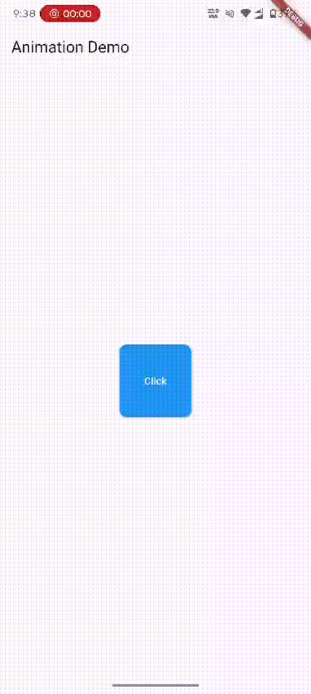
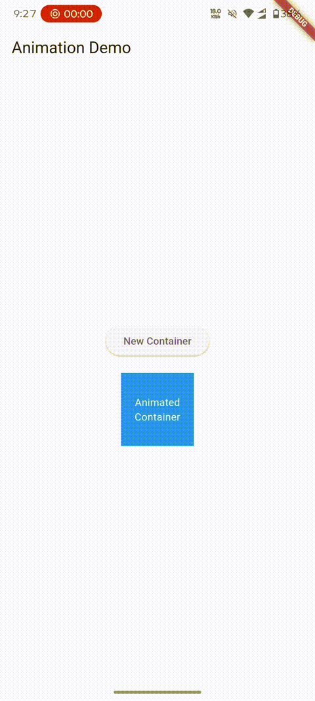
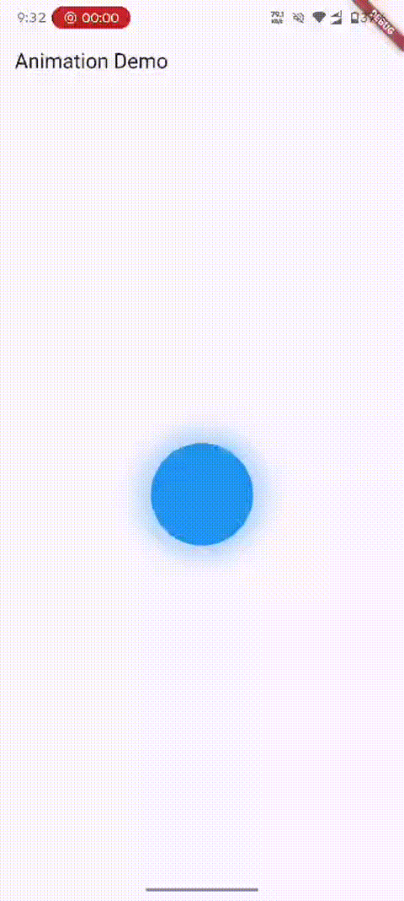
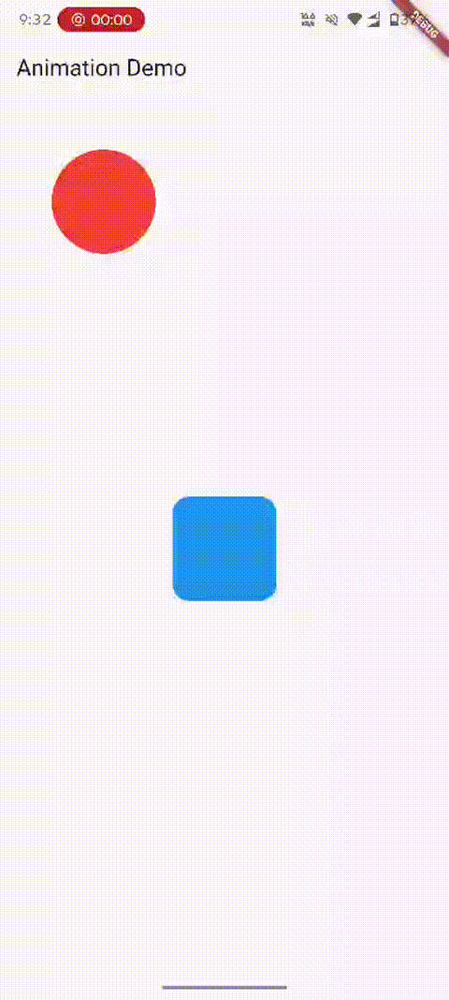

# Flutter Implicit Animation Tutorial

This folder contains 4 practical examples demonstrating Implicit Animations in Flutter. These are animations that automatically transition between state changes without explicitly controlling the animation timeline.

Implicit animations in Flutter are widgets that automatically animate when their properties change. They are easier to use than explicit animations because you don't need to create and manage `AnimationController` instances.

---

## Examples Breakdown

### 1. **Button Animation** (`button_animation.dart`)

**Video**: 



#### What It Does:
An interactive button that grows, changes color, and adjusts its shape when clicked.

#### Key Concepts:
- **Widget Used**: `AnimatedContainer`
- **Animated Properties**:
  - Width: 100 → 300 (when clicked)
  - Height: 100 → 200 (when clicked)
  - Background Color: Blue → Green
  - Border Radius: 10 → 50 (fully rounded)

#### Approach:
```dart
// State variable to track button state
bool isClicked = false;

// AnimatedContainer smoothly transitions between properties
AnimatedContainer(
  duration: Duration(milliseconds: 300),
  width: isClicked ? 300 : 100,
  height: isClicked ? 200 : 100,
  curve: Curves.fastOutSlowIn,
  // ... other properties
)

// setState toggles the state
onPressed: () {
  setState(() {
    isClicked = !isClicked;
  });
}
```

#### Learning Points:
- Multiple properties can be animated simultaneously
- `Curves.fastOutSlowIn` creates a natural feel with slow start and fast end
- Text updates with animation (different text when clicked)

---

### 2. **Container Animation** (`container_animation.dart`)
**Video**: 




#### What It Does:
A simple container that smoothly changes color between blue and red when a button is tapped.

#### Key Concepts:
- **Widget Used**: `AnimatedContainer`
- **Animated Properties**:
  - Background Color: Blue ↔ Red

#### Approach:
```dart
// State variables
bool showContainer = false;
Color currentColor = Colors.blue;

// Function to toggle color
void changeColorofContainer() {
  setState(() {
    currentColor = currentColor == Colors.blue ? Colors.red : Colors.blue;
  });
}

// AnimatedContainer applies smooth color transition
AnimatedContainer(
  duration: Duration(milliseconds: 500),
  color: currentColor,
  curve: Curves.slowMiddle,
  // ...
)
```

#### Learning Points:
- `Curves.slowMiddle` creates a slow, smooth transition
- This is the simplest form of implicit animation
- Color transitions are very common in UI design

---

### 3. **Pulsating Animation** (`pulsating_animation.dart`)
**Video**:



#### What It Does:
A blue circle that continuously scales up and down, creating a pulsating/breathing effect with a glowing shadow.

#### Key Concepts:
- **Widget Used**: `TweenAnimationBuilder`
- **Animated Properties**:
  - Scale: 0.5 → 1.5 → 0.5 (repeating)
  - Shadow effect changes with scale

#### Approach:
```dart
// State variable to control animation direction
bool _forward = true;

TweenAnimationBuilder(
  tween: Tween<double>(
    begin: _forward ? 0.5 : 1.5,
    end: _forward ? 1.5 : 0.5,
  ),
  duration: Duration(milliseconds: 1500),
  builder: (context, scale, child) {
    return Transform.scale(
      scale: scale,
      child: Container(/* circle */)
    );
  },
  onEnd: () {
    // Restart animation when it ends
    setState(() => _forward = !_forward);
  },
)
```

#### Learning Points:
- `TweenAnimationBuilder` gives more control over animations
- `onEnd()` callback allows looping animations
- `Transform.scale` applies the animated scale value
- Shadow spreads based on scale for visual effect

---

### 4. **Tap & Drag Animation** (`tap_drag_animation.dart`)
**Video**:



#### What It Does:
Combines two interactive animations:
1. **Blue Square**: Grows larger when tapped (using `AnimatedScale`)
2. **Red Circle**: Can be dragged around the screen

#### Key Concepts:
- **Widgets Used**: 
  - `AnimatedScale` for the tap-to-grow effect
  - `GestureDetector` with `onPanUpdate` for dragging
- **Composition**: Multiple animated widgets working together in a `Stack`

#### Approach:

**Tap-to-Grow Widget**:
```dart
bool _isBig = false;

AnimatedScale(
  scale: _isBig ? 1.5 : 1.0,
  duration: Duration(milliseconds: 300),
  curve: Curves.easeOutBack, // Has overshoot effect
  child: GestureDetector(
    onTap: () => setState(() => _isBig = !_isBig),
    child: Container(/* blue square */)
  ),
)
```

**Draggable Widget**:
```dart
double x = 100;
double y = 100;

Positioned(
  left: x - 50,
  top: y - 50,
  child: GestureDetector(
    onPanUpdate: (details) {
      setState(() {
        x += details.delta.dx;
        y += details.delta.dy;
      });
    },
    child: Container(/* red circle */)
  ),
)
```

#### Learning Points:
- `AnimatedScale` is simpler than `AnimatedContainer` for scale changes
- `Curves.easeOutBack` creates an overshoot effect (bouncy feel)
- `Stack` + `Positioned` allows absolute positioning
- `GestureDetector` with `onPanUpdate` enables drag functionality
- `details.delta` gives the distance moved since last update

---

## Implicit Animation Widgets Summary

| Widget | Best For | Key Advantage |
|--------|----------|---------------|
| `AnimatedContainer` | Multiple property changes | Simple, all-in-one solution |
| `AnimatedScale` | Just scale changes | Simpler than AnimatedContainer |
| `AnimatedOpacity` | Fade in/out effects | Perfect for visibility changes |
| `TweenAnimationBuilder` | Custom value interpolation | More control over animation |
| `SlideTransition` | Position changes | Smooth position animations |

---

## Common Patterns Used

### 1. **State-Driven Animation**
```dart
// Change state → Widget detects change → Animation occurs automatically
setState(() {
  isClicked = !isClicked;  // Change state
});
// AnimatedContainer rebuilds with new values and animates the transition
```

### 2. **Easing Curves**
Different curves create different feels:
- `Curves.linear` - Constant speed
- `Curves.easeOut` - Fast start, slow end
- `Curves.easeOutBack` - Bouncy/overshoot effect
- `Curves.slowMiddle` - Slow in the middle
- `Curves.fastOutSlowIn` - Natural motion

### 3. **Gesture Integration**
```dart
GestureDetector(
  onTap: () => setState(() => /* change state */),
  onPanUpdate: (details) => setState(() => /* update position */),
  child: Container()
)
```

