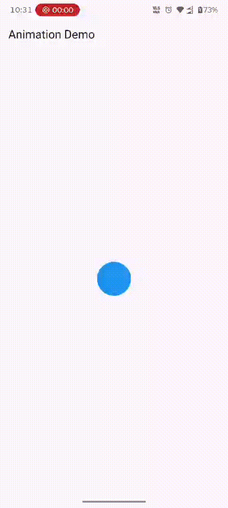
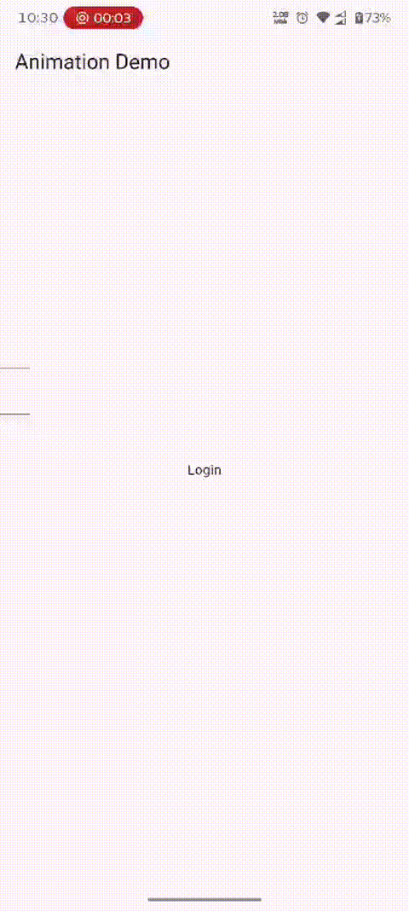
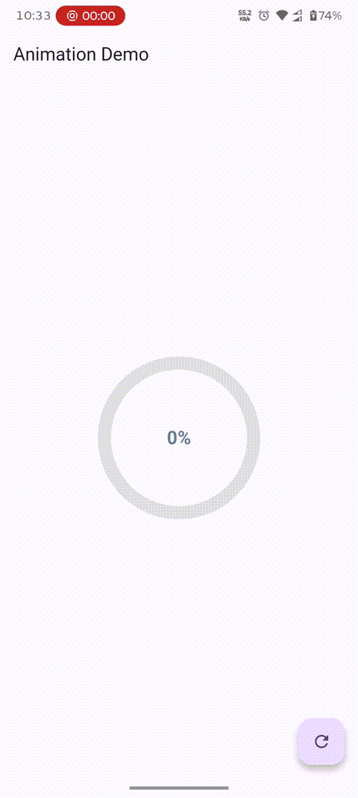
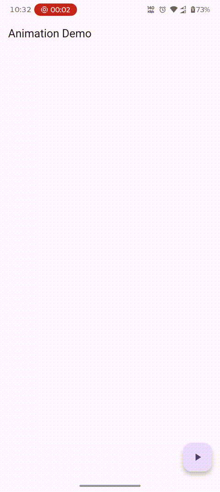

# Flutter Explicit Animations — Practical Examples

A hands-on collection of 4 examples that demonstrate how **explicit animations** work in Flutter. Each example builds on the previous one, introducing new concepts progressively.

---

## What Are Explicit Animations?

Explicit animations give you **direct control** over the animation timeline. Instead of Flutter deciding when and how to animate, you drive everything manually through an `AnimationController`.

| Type | Who controls the animation? | Examples |
|---|---|---|
| **Implicit** | Flutter handles it automatically | `AnimatedContainer`, `AnimatedScale` |
| **Explicit** | You control it with `AnimationController` | `AnimationController` + `ScaleTransition`, `FadeTransition`, `SlideTransition` |

With explicit animations, you create the controller, define the tween, attach a curve, and tell it when to play, reverse, repeat, or stop. More setup — but complete control.

---

## The Building Blocks

Every explicit animation in this project is built from the same set of pieces. Understanding each one separately makes the full picture much easier to read.

### `AnimationController`

The heartbeat of every explicit animation. It produces a value that ticks from `0.0` to `1.0` over a given `duration`. You call `.forward()` to start it, `.reverse()` to play it backwards, `.repeat()` to loop it, and `.reset()` to return it to zero.

It needs a `vsync` to tie itself to the screen's refresh rate — without it, it would run on its own clock and waste resources when the widget is off screen. `SingleTickerProviderStateMixin` provides that `vsync`.

```
_controller.forward()   →  value goes 0.0 → 1.0
_controller.reverse()   →  value goes 1.0 → 0.0
_controller.repeat()    →  loops 0.0 → 1.0 → 0.0 forever
_controller.reset()     →  snaps value back to 0.0
```

### `Tween`

A `Tween` maps the controller's raw `0.0–1.0` value into a useful range. On its own, the controller only knows about 0 to 1. A `Tween` says "treat 0.0 as this value and 1.0 as that value."

```dart
Tween<double>(begin: 0.5, end: 1.5)
// controller at 0.0  →  gives you 0.5
// controller at 0.5  →  gives you 1.0
// controller at 1.0  →  gives you 1.5
```

You can tween any type that supports interpolation — `double`, `Color`, `Offset`, `Size`, `BorderRadius`, and more.

### `CurvedAnimation`

A `CurvedAnimation` wraps the controller and applies an easing curve to its progress before it reaches the `Tween`. The controller still ticks linearly from 0 to 1, but the curve reshapes *how fast* it moves through that range.

```dart
CurvedAnimation(parent: _controller, curve: Curves.easeOut)
```

### `Animation<T>`

The result of attaching a `Tween` to a controller (with or without a curve). It is a read-only object that holds the current animated value. You pass it to transition widgets like `FadeTransition`, `ScaleTransition`, and `SlideTransition`.

```dart
// Full chain: controller → curve → tween → Animation
_animation = Tween<double>(begin: 0.0, end: 1.0).animate(
  CurvedAnimation(parent: _controller, curve: Curves.easeOut),
);
```

### `AnimatedBuilder`

When a transition widget doesn't exist for what you need, `AnimatedBuilder` lets you rebuild any widget manually each time the animation value changes. You pass it an animation and a `builder` function — the builder fires on every tick and gives you access to the current value.

### Transition Widgets

Flutter provides ready-made widgets that accept an `Animation` directly and handle the rendering for you — `FadeTransition` for opacity, `SlideTransition` for position, `ScaleTransition` for scale. These are more efficient than `AnimatedBuilder` for their specific use cases because they skip the full widget rebuild.

---

## Project Structure

```
lib/
├── pulsating_animation_explicit.dart   # AnimationController basics — repeat + ScaleTransition
├── login_screen_animation.dart         # Multiple animations from one controller
├── progressbar_animation.dart          # AnimatedBuilder — custom rendering with animation value
└── list_animation.dart                 # Staggered animations using Interval
```

---

## Examples

---

### 1. Pulsating Animation (Explicit) — `pulsating_animation_explicit.dart`



#### What It Does

A blue circle that continuously scales up and down — the same visual result as the implicit pulsating example, but built with an `AnimationController`. This is the best starting point because it uses the controller in its simplest form with no extra complexity.

#### Why Explicit Here?

In the implicit version, looping required a `_forward` bool toggle, `onEnd`, and a `setState` call to rebuild the widget on every cycle. The explicit version needs none of that. The controller loops on its own without any state changes or rebuilds — you just tell it `repeat(reverse: true)` and walk away.

#### Code

```dart
late AnimationController _controller;
late Animation<double> _animation;

@override
void initState() {
  super.initState();

  _controller = AnimationController(
    duration: Duration(seconds: 2),
    vsync: this,
  )..repeat(reverse: true);

  _animation = Tween<double>(begin: 0.5, end: 1.5).animate(_controller);
}
```

`..repeat(reverse: true)` is a cascade — it calls `repeat` on the controller immediately after creating it, in the same expression. `reverse: true` makes it play forward then backward, creating the smooth grow-and-shrink cycle.

The `Tween` maps the controller's 0–1 progress to a scale range of 0.5–1.5. There is no `CurvedAnimation` here — the scale changes at a constant rate, which works fine for a looping pulse.

```dart
ScaleTransition(
  scale: _animation,
  child: Container(
    width: 100,
    height: 100,
    decoration: BoxDecoration(
      color: Colors.blue,
      shape: BoxShape.circle,
    ),
  ),
)
```

`ScaleTransition` accepts the `Animation<double>` directly and scales its child on every tick. No `setState`, no `builder` function — it listens to the animation internally and repaints only what it needs to.

#### `dispose` — Why It Matters

```dart
@override
void dispose() {
  _controller.dispose();
  super.dispose();
}
```

`AnimationController` runs on a `Ticker` that fires every frame. If you don't dispose it when the widget leaves the screen, the ticker keeps running and consuming memory forever. This is the most common source of memory leaks in Flutter animation code. Every controller must be disposed.

---

### 2. Login Screen Animation — `login_screen_animation.dart`



#### What It Does

A login screen where the Flutter logo fades in and the form fields slide in from the top-left corner — both animated simultaneously from a single `AnimationController`.

#### One Controller, Multiple Animations

A single `AnimationController` can drive as many `Animation` objects as you want. Each one is just a different `Tween` attached to the same controller. When the controller ticks, all of them update at the same time.

```
_controller ticks 0.0 → 1.0
        ├── _opacityAnimation  →  0.0 → 1.0 (logo fades in)
        └── _slideAnimation    →  Offset(-1,-1) → Offset.zero (form slides in)
```

This is cleaner than managing two separate controllers with two separate `dispose` calls and two separate `initState` setups.

#### Code

```dart
_controller = AnimationController(
  duration: Duration(seconds: 2),
  vsync: this,
)..repeat(reverse: true);

_opacityAnimation = Tween<double>(
  begin: 0.0,
  end: 1.0,
).animate(_controller);

_slideAnimation = Tween<Offset>(
  begin: Offset(-1, -1),
  end: Offset.zero,
).animate(_controller);

_controller.forward();
```

Both animations are created in `initState` and attached to the same `_controller`. When `_controller.forward()` is called, both start moving together.

`Offset` in a `SlideTransition` is measured in fractions of the widget's own size, not pixels. `Offset(-1, -1)` means one full widget-width to the left and one full widget-height upward. `Offset.zero` is the widget's natural resting position. So the form slides from off-screen diagonally into place.

#### Applying the Animations

```dart
FadeTransition(
  opacity: _opacityAnimation,
  child: FlutterLogo(size: 100),
),

SlideTransition(
  position: _slideAnimation,
  child: Column(
    children: [
      TextField(decoration: InputDecoration(hintText: 'Email')),
      TextField(decoration: InputDecoration(hintText: 'Password'), obscureText: true),
      SizedBox(height: 20),
      FilledButton(onPressed: () {}, child: Text('Login')),
    ],
  ),
),
```

`FadeTransition` and `SlideTransition` each take their respective `Animation` object and handle the rendering themselves. The logo and the form are completely independent widgets but they animate in sync because they share the same controller timeline.

---

### 3. Circular Progress Bar — `progressbar_animation.dart`



#### What It Does

A circular progress indicator that animates from 0% to 75% when the screen loads, with a percentage counter in the center that updates as the bar fills. A refresh button resets and replays the animation.

#### Why `AnimatedBuilder` Instead of a Transition Widget

`FadeTransition` and `SlideTransition` work because opacity and position are standard, well-defined properties Flutter knows how to animate. But `CircularProgressIndicator` takes a raw `double` for its `value` property — there is no `CircularProgressTransition` widget that accepts an `Animation` directly.

`AnimatedBuilder` fills this gap. It rebuilds its `builder` on every animation tick, giving you the current value to use however you need.

```dart
AnimatedBuilder(
  animation: _animation,
  builder: (context, child) {
    return Stack(
      alignment: Alignment.center,
      children: [
        SizedBox(
          width: 180,
          height: 180,
          child: CircularProgressIndicator(
            value: _animation.value,
            strokeWidth: 16,
            backgroundColor: Colors.grey[300],
            strokeCap: StrokeCap.round,
          ),
        ),
        Text(
          '${(_animation.value * 100).toInt()}%',
          style: const TextStyle(
            fontSize: 22,
            fontWeight: FontWeight.bold,
            color: Colors.blueGrey,
          ),
        ),
      ],
    );
  },
)
```

`_animation.value` is the live animated double — both the progress bar and the text percentage read from it on every frame, so they always stay in sync.

#### The Setup

```dart
double progress = 0.75;

_controller = AnimationController(
  duration: const Duration(seconds: 1),
  vsync: this,
);

_animation = Tween<double>(begin: 0.0, end: progress).animate(_controller);
```

The tween ends at `progress` (0.75), so the animation naturally stops at 75%. To play a different completion percentage, you only change the `progress` variable.

#### The Reset Button

```dart
floatingActionButton: FloatingActionButton(
  onPressed: () {
    _controller.reset();
    _controller.forward();
  },
  child: const Icon(Icons.refresh),
),
```

`reset()` snaps the controller back to 0.0 immediately. `forward()` then plays it again from the start. The two calls together create the replay effect.

---

### 4. List Stagger Animation — `list_animation.dart`



#### What It Does

A list of 20 items that slide in from the left one after another — each item starting slightly later than the one before it, creating a cascading stagger effect. A button plays and reverses the animation.

#### The Core Idea — `Interval`

A normal animation runs from 0.0 to 1.0 and every widget listening to it moves at the same time. Staggering means each item needs to start at a different point in the controller's timeline.

`Interval` makes this possible. It tells a `CurvedAnimation` to only pay attention to a specific slice of the controller's 0.0–1.0 range and stay at 0.0 before its window and 1.0 after it.

```dart
Interval(0.0, 1.0)   // active the whole time — item 0 starts immediately
Interval(0.05, 1.0)  // ignores the first 5% — item 1 starts slightly later
Interval(0.10, 1.0)  // ignores the first 10% — item 2 starts later still
```

Each item gets an interval that starts `index * (1 / itemCount)` into the timeline. With 20 items, item 0 starts at 0%, item 1 at 5%, item 2 at 10%, and so on. The result is each item begins sliding in just after the previous one.

#### Generating the Animations

```dart
_controller = AnimationController(
  duration: const Duration(seconds: 2),
  vsync: this,
);

_animations = List.generate(20, (index) {
  return Tween<Offset>(
    begin: const Offset(-1, 0),
    end: Offset.zero,
  ).animate(
    CurvedAnimation(
      parent: _controller,
      curve: Interval(index * (1 / itemCount), 1.0, curve: Curves.easeOut),
    ),
  );
});
```

`List.generate` creates 20 animations in one shot. Each one uses the same `Tween` — slide from left (`Offset(-1, 0)`) to resting position (`Offset.zero`) — but with a different `Interval` so each one wakes up at a different moment in the timeline.

`Curves.easeOut` is passed inside the `Interval`. This means once an item's window opens, it eases out as it slides in — fast at first, then gently slowing to a stop.

There is only **one** `AnimationController` here. One controller, one `forward()` call, and all 20 items animate in a cascade — because each item's `Interval` decides when it personally starts.

#### Applying in the List

```dart
ListView.builder(
  itemCount: 20,
  itemBuilder: (context, index) {
    return SlideTransition(
      position: _animations[index],
      child: ListTile(title: Text('Item in the list $index')),
    );
  },
)
```

Each list item wraps itself in a `SlideTransition` and picks its own animation from the list by index. The `ListView.builder` only builds items as they scroll into view — so the stagger effect is efficient even for long lists.

#### Play and Reverse

```dart
floatingActionButton: FloatingActionButton(
  onPressed: () {
    if (_controller.isCompleted) {
      _controller.reverse();
    } else {
      _controller.forward();
    }
  },
  child: const Icon(Icons.play_arrow),
),
```

`_controller.isCompleted` is true when the controller has reached 1.0. Reversing from a completed state plays the stagger backwards — items slide back out to the left in reverse order, which looks as clean as the entry.

---

## Explicit Animation Widgets — Quick Reference

| Widget | Use When |
|---|---|
| `ScaleTransition` | Animating scale with an `Animation<double>` |
| `FadeTransition` | Animating opacity with an `Animation<double>` |
| `SlideTransition` | Animating position with an `Animation<Offset>` |
| `RotationTransition` | Animating rotation with an `Animation<double>` |
| `AnimatedBuilder` | Animating anything that doesn't have a transition widget |
| `SizeTransition` | Animating the size/clip of a widget |

---

## Core Pattern — How Every Example Works

Every explicit animation follows the same setup flow:

```
initState()
    ↓
Create AnimationController  →  defines duration + vsync
    ↓
Create Tween                →  defines value range (e.g. 0.5 to 1.5)
    ↓
Attach to controller        →  .animate(_controller) produces Animation<T>
    ↓  (optional)
Wrap in CurvedAnimation     →  shapes how fast the value moves
    ↓
Pass Animation to widget    →  ScaleTransition, FadeTransition, AnimatedBuilder
    ↓
Call .forward() / .repeat() →  starts the animation

dispose()
    ↓
_controller.dispose()       →  always required, stops the ticker
```

The key difference from implicit animations: **you own the lifecycle**. You start it, you stop it, you dispose it. That extra responsibility is what gives you the power to loop, chain, stagger, reverse, and pause with precision.