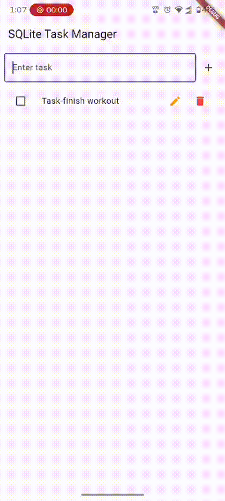
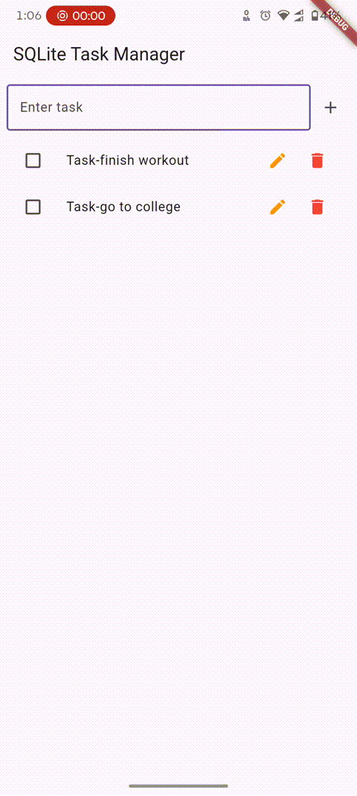
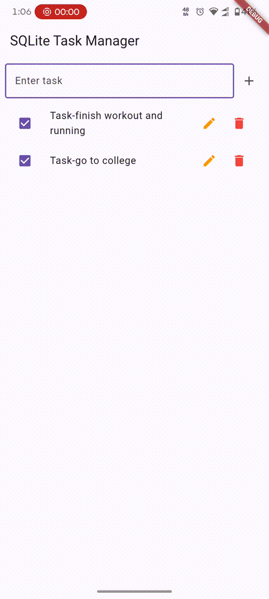

# Flutter SQLite Task Manager

A local task management app built with Flutter and `sqflite`. Tasks are stored on-device using SQLite — no backend, no internet required. Supports full CRUD: create, read, update, and delete tasks, with a checkbox to mark them done.

---

## Screenshots / Demo

| Consistent Storage | Update Task | Delete Task |
|----------|-------------|-------------|
|  |  |  |

---

## Project Structure

```
lib/
├── main.dart
├── my_app.dart
├── db/
│   └── database.dart
├── model/
│   └── task_model.dart
└── pages/
    └── home_page.dart
```

---

## Build Order — How to Build This Yourself, Step by Step

If you were building this from scratch, this is the order that actually makes sense (bottom-up: data shape → storage → operations → UI):

1. **Create the model first** (`task_model.dart`)
   - Decide what a "task" is: `id`, `title`, `isDone`.
   - Add `toMap()` / `fromMap()` so it can be converted to/from a SQLite row.
   - No dependency on anything else — this is the foundation everything builds on.

2. **Set up the database connection** (`database.dart`)
   - Add the `sqflite` and `path` packages to `pubspec.yaml`.
   - Write `getDB()` to open (or reuse) a single database connection.
   - Define the `CREATE TABLE` statement inside `onCreate` so the `tasks` table exists on first run.

3. **Add CRUD methods on top of that connection** (still `database.dart`)
   - `insertTask()` → Create
   - `getTasks()` → Read
   - `updateTask()` → Update
   - `deleteTask()` → Delete
   - Each one just calls `getDB()` then the matching `sqflite` method — the model's `toMap()`/`fromMap()` do the conversion work.

4. **Build the UI and wire it to the database** (`home_page.dart`)
   - Add state: a `List<TaskModel>` and a `TextEditingController`.
   - Load data once on screen open (`initState` → `refreshTask`).
   - Add a text field + button that calls `insertTask`.
   - Render the list with `ListView.builder`, one `ListTile` per task.
   - Wire the checkbox to `updateTask` (toggle done), the edit icon to a dialog that also calls `updateTask`, and the delete icon to `deleteTask`.
   - After every write, re-run `refreshTask()` so the UI reflects what's actually in the database.

5. **Wire up the app shell and entry point** (`my_app.dart`, `main.dart`)
   - `MyApp` wraps everything in a `MaterialApp` and sets `HomePage` as the home screen.
   - `main.dart` calls `runApp(MyApp())` to actually launch it.

In short: **model → database connection → CRUD → UI → app shell/entry point.** Each layer only depends on the one before it, which is why building in this order avoids backtracking.

---

## Functions: Ours vs. Flutter/`sqflite`-Provided

It helps to know which functions you actually write yourself versus which ones come from the framework/packages.

### Written by us (app-specific logic)

| Function | File | Purpose |
|---|---|---|
| `TaskModel()` constructor | `task_model.dart` | Builds a task object |
| `toMap()` | `task_model.dart` | Converts a `TaskModel` → `Map` for SQLite |
| `TaskModel.fromMap()` | `task_model.dart` | Converts a raw DB row → `TaskModel` |
| `getDB()` | `database.dart` | Opens/reuses our single database connection |
| `insertTask()` | `database.dart` | Our Create wrapper around `db.insert()` |
| `getTasks()` | `database.dart` | Our Read wrapper around `db.query()` |
| `updateTask()` | `database.dart` | Our Update wrapper around `db.update()` |
| `deleteTask()` | `database.dart` | Our Delete wrapper around `db.delete()` |
| `refreshTask()` | `home_page.dart` | Re-fetches tasks and calls `setState` |
| `addTask()` | `home_page.dart` | Validates input, calls `insertTask` |
| `showUpdateDialog()` | `home_page.dart` | Builds and shows our edit dialog |
| `HomePage.updateTask()` / `deleteTask()` wrappers | `home_page.dart` | Call the database layer, then `refreshTask()` |
| `HomePage.build()` | `home_page.dart` | Our screen layout |
| `MyApp.build()` | `my_app.dart` | Our app configuration |
| `main()` | `main.dart` | Our entry point |

### Provided by Flutter / `sqflite` / Dart (we just call them)

| Function / API | Comes from | Purpose |
|---|---|---|
| `runApp()` | Flutter | Mounts the widget tree and starts the app |
| `StatelessWidget`, `StatefulWidget`, `State` | Flutter | Base classes for building widgets |
| `build()` (the framework hook itself) | Flutter | Called by Flutter whenever a widget needs (re)drawing |
| `initState()` | Flutter | Lifecycle hook called once when a `State` is created |
| `setState()` | Flutter | Tells Flutter to rebuild a widget |
| `MaterialApp`, `Scaffold`, `AppBar`, `Column`, `Row`, `Expanded`, `Padding`, `ListTile`, `Checkbox`, `TextField`, `IconButton`, `AlertDialog`, `TextButton`, `ElevatedButton` | Flutter Material widgets | Pre-built UI components |
| `ListView.builder()` | Flutter | Efficient, lazily-built scrolling list |
| `TextEditingController` | Flutter | Manages a text field's content programmatically |
| `showDialog()` | Flutter | Displays a modal dialog above the current screen |
| `Navigator.pop()` | Flutter | Closes the current dialog/route |
| `openDatabase()` | `sqflite` | Opens (or creates) a SQLite database file |
| `getDatabasesPath()` | `sqflite` | Returns the platform-correct folder for database files |
| `db.insert()`, `db.query()`, `db.update()`, `db.delete()` | `sqflite` | Actual SQL operations against the opened database |
| `ConflictAlgorithm.replace` | `sqflite` | Built-in conflict-resolution strategy for inserts |
| `path.join()` | `path` package | Joins path segments in an OS-safe way |
| `Future`, `async`, `await` | Dart language | Language-level asynchronous programming support |

---

## `main.dart` — Entry Point

```dart
import 'package:flutter/material.dart';
import 'my_app.dart';

void main() {
  runApp(const MyApp());
}
```

- `main()` — **Flutter/Dart-provided entry hook.** This is where every Dart program starts.
- `runApp()` — **Flutter-provided.** Takes a widget and makes it the root of the entire widget tree.
- `const MyApp()` — our widget, passed in with a `const` constructor so Flutter can skip rebuilding it unnecessarily.

---

## `my_app.dart` — App Shell

```dart
import 'package:flutter/material.dart';
import 'pages/home_page.dart';

class MyApp extends StatelessWidget {
  const MyApp({super.key});

  @override
  Widget build(BuildContext context) {
    return MaterialApp(
      title: 'Flutter Demo',
      theme: ThemeData(primarySwatch: Colors.blue),
      home: HomePage(),
    );
  }
}
```

- `MyApp` is **our class**, extending Flutter's built-in `StatelessWidget` — used because the app shell never changes after it's built.
- `build()` is a **Flutter lifecycle method we override**; Flutter calls it for us.
- `MaterialApp` is a **Flutter-provided widget** that sets up Material Design defaults (theming, navigation). Three things are configured here:
  - `title` — used by the OS (e.g. app switcher), not shown inside the app.
  - `theme` — sets a blue color scheme via `ThemeData`.
  - `home` — the first screen shown, set to our `HomePage()`.

---

## `task_model.dart` — The Model

```dart
class TaskModel {
  final int? id;
  final String title;
  final bool isDone;

  TaskModel({this.id, required this.title, required this.isDone});

  Map<String, dynamic> toMap() {
    return {'id': id, 'title': title, 'isDone': isDone ? 1 : 0};
  }

  factory TaskModel.fromMap(Map<String, dynamic> map) {
    return TaskModel(
      id: map['id'],
      title: map['title'],
      isDone: map['isDone'] == 1,
    );
  }
}
```

### Fields

- `id` — `int?` (nullable). A task built in memory before being saved has no id yet; SQLite assigns one on insert.
- `title` — the task text.
- `isDone` — whether the task is checked off.
- All three are `final` → a `TaskModel` is **immutable**. Changing a task means building a new `TaskModel`, not mutating the old one (used throughout `home_page.dart`).

### Why the boolean needs converting

- SQLite has no native boolean type — only integers.
- `isDone` must be translated in both directions when reading/writing.

### `toMap()` — *ours*

- Converts the object into a `Map<String, dynamic>` for SQLite.
- Turns `isDone` into `1` or `0`.

### `TaskModel.fromMap()` — *ours*

- A `factory` constructor (not a normal one) because it receives a raw `Map` and has to extract/transform values before building the object — that's the standard Dart pattern for deserializing from JSON or DB rows.
- Converts `1`/`0` back into `true`/`false` via `map['isDone'] == 1`.

### Where these are used

- `toMap()` → called inside every write in `database.dart` (`insertTask`, `updateTask`).
- `fromMap()` → called inside `getTasks()` to turn each raw row back into a `TaskModel`.

---

## `database.dart` — The Database Layer

```dart
import 'package:path/path.dart' as path;
import 'package:sqflite/sqflite.dart';
import '../model/task_model.dart';

class TaskDatabase {
  static Database? _database;

  static Future<Database> getDB() async {
    if (_database != null) return _database!;

    String dbPath = await getDatabasesPath();
    String fullPath = path.join(dbPath, 'tasks.db');
    _database = await openDatabase(
      fullPath,
      version: 1,
      onCreate: (db, version) {
        return db.execute(
          'CREATE TABLE tasks(id INTEGER PRIMARY KEY AUTOINCREMENT, title TEXT, isDone INTEGER)',
        );
      },
    );
    return _database!;
  }

  static Future<void> insertTask(TaskModel task) async {
    final db = await getDB();
    await db.insert(
      'tasks',
      task.toMap(),
      conflictAlgorithm: ConflictAlgorithm.replace,
    );
  }

  static Future<List<TaskModel>> getTasks() async {
    final db = await getDB();
    final List<Map<String, dynamic>> tasks = await db.query('tasks');
    return List.generate(tasks.length, (i) => TaskModel.fromMap(tasks[i]));
  }

  static Future<void> deleteTask(int id) async {
    final db = await getDB();
    await db.delete('tasks', where: 'id = ?', whereArgs: [id]);
  }

  static Future<void> updateTask(TaskModel task) async {
    final db = await getDB();
    await db.update(
      'tasks',
      task.toMap(),
      where: 'id = ?',
      whereArgs: [task.id],
    );
  }
}
```

### Why everything is `static`

- `TaskDatabase` is never instantiated — methods are called directly on the class (`TaskDatabase.getTasks()`).
- Enforces a single shared database connection across the whole app.
- Removes the need to pass a `TaskDatabase` instance around every widget.

### `getDB()` — *ours*, using `sqflite`'s `openDatabase()`

- `_database` starts `null`.
- First call → `_database` is `null` → opens the DB via `openDatabase()` (Flutter/`sqflite`-provided) and caches it.
- Every later call → `_database` is already set → returned immediately, skipping `openDatabase` entirely.
- This "build once, reuse after" pattern is called **lazy initialization**.
- `getDatabasesPath()` (`sqflite`) + `path.join()` (`path` package) build a platform-correct file path for `tasks.db`.
- `onCreate` only runs the *first* time the app runs on a device (i.e. only if the DB file doesn't exist yet) — that's where the table is created:

```sql
CREATE TABLE tasks(id INTEGER PRIMARY KEY AUTOINCREMENT, title TEXT, isDone INTEGER)
```

- `id` auto-increments; `title` is text; `isDone` is an integer (no boolean type in SQLite).
- `getDB()` is never called from the UI directly — every other method here calls it first to get the connection.

### `insertTask()` — *ours* (Create)

- Calls `task.toMap()` to shape the data for SQLite.
- Uses `db.insert()` — **`sqflite`-provided** — to actually write the row.
- `ConflictAlgorithm.replace` (`sqflite`) — if a row with the same primary key exists, it's overwritten instead of throwing.

### `getTasks()` — *ours* (Read)

- Calls `db.query('tasks')` (**`sqflite`-provided**) with no filter → returns every row as raw maps.
- `List.generate` (**Dart-provided**) walks the raw rows and runs `TaskModel.fromMap()` on each to produce typed objects.

### `updateTask()` — *ours* (Update)

- Uses `db.update()` (**`sqflite`-provided**).
- `where: 'id = ?'` scopes the change to one row.
- `whereArgs: [task.id]` passes the id as a separate parameter rather than concatenating it into the query string — this is what prevents SQL injection.

### `deleteTask()` — *ours* (Delete)

- Uses `db.delete()` (**`sqflite`-provided**) with the same `where`/`whereArgs` pattern.
- Takes just an `id`, since deleting doesn't need any other field.

---

## `home_page.dart` — The UI Layer

```dart
import 'package:flutter/material.dart';
import '../db/database.dart';
import '../model/task_model.dart';

class HomePage extends StatefulWidget {
  const HomePage({super.key});

  @override
  State<HomePage> createState() => _HomePageState();
}

class _HomePageState extends State<HomePage> {
  List<TaskModel> tasks = [];
  TextEditingController taskController = TextEditingController();

  Future<void> refreshTask() async {
    tasks = await TaskDatabase.getTasks();
    setState(() {});
  }

  Future<void> addTask() async {
    if (taskController.text.isEmpty) return;
    await TaskDatabase.insertTask(
      TaskModel(title: taskController.text, isDone: false),
    );
    taskController.clear();
    refreshTask();
  }

  Future<void> deleteTask(int id) async {
    await TaskDatabase.deleteTask(id);
    refreshTask();
  }

  Future<void> updateTask(TaskModel task) async {
    await TaskDatabase.updateTask(task);
    refreshTask();
  }

  Future<void> showUpdateDialog(TaskModel task) async {
  // Create a controller pre-filled with the current task title
  final editController = TextEditingController(text: task.title);

  return showDialog<void>(
    context: context,
    builder: (BuildContext context) {
      return AlertDialog(
        title: const Text('Update Task'),
        content: TextField(
          controller: editController,
          decoration: const InputDecoration(
            hintText: "Enter updated task",
            border: OutlineInputBorder(),
          ),
        ),
        actions: [
          TextButton(
            onPressed: () => Navigator.pop(context), // Close without saving
            child: const Text('Cancel', style: TextStyle(color: Colors.grey)),
          ),
          ElevatedButton(
            onPressed: () {
              if (editController.text.trim().isEmpty) return;

              // Call your update function with the modified title
              updateTask(
                TaskModel(
                  id: task.id,
                  title: editController.text.trim(),
                  isDone: task.isDone,
                ),
              );

              Navigator.pop(context); // Close the dialog
            },
            child: const Text('Save'),
          ),
        ],
      );
    },
  );
}
  @override
  void initState() {
    super.initState();
    // Example of inserting a task
    refreshTask();
  }

  @override
  Widget build(BuildContext context) {
    return Scaffold(
      appBar: AppBar(title: const Text('SQLite Task Manager')),
      body: Column(
        children: [
          Padding(
            padding: EdgeInsets.all(8.0),
            child: Row(
              children: [
                Expanded(
                  child: TextField(
                    controller: taskController,
                    decoration: InputDecoration(
                      hintText: 'Enter task',
                      border: OutlineInputBorder(),
                    ),
                  ),
                ),
                IconButton(onPressed: addTask, icon: Icon(Icons.add)),
              ],
            ),
          ),
          Expanded(
            child: ListView.builder(
              itemCount: tasks.length,
              itemBuilder: (context, index) {
                return ListTile(
                  leading: Checkbox(
                    value: tasks[index].isDone,
                    onChanged: (_) {
                      updateTask(
                        TaskModel(
                          id: tasks[index].id,
                          title: tasks[index].title,
                          isDone: !tasks[index].isDone,
                        ),
                      );
                    },
                  ),
                  // Removed unnecessary curly braces around index
                  title: Text('Task-${tasks[index].title}'),
                  trailing: Row(
                    mainAxisSize: MainAxisSize.min,
                    children: [
                      IconButton(
                        onPressed: () {
                          showUpdateDialog(tasks[index]);
                        },
                        icon: const Icon(Icons.edit, color: Colors.orange),
                      ),
                      IconButton(
                        onPressed: () => deleteTask(tasks[index].id!),
                        icon: const Icon(Icons.delete, color: Colors.red),
                      ),
                    ],
                  ),
                );
              },
            ),
          ),
        ],
      ),
    );
  }
}
```

### State fields

- `tasks` — our in-memory copy of what's in the database; `ListView.builder` reads from this to draw the list.
- `taskController` — a **Flutter-provided** `TextEditingController` that drives the "new task" text field; exposes `.text` and lets us `.clear()` it.

### `initState()` — Flutter-provided lifecycle hook, our logic inside

- Runs exactly once, right when the widget is first inserted into the tree, before the first `build()`.
- We call `refreshTask()` here so the list populates as soon as the screen opens.

### `refreshTask()` — *ours* (the pattern every write follows)

- Re-fetches the full list from `TaskDatabase.getTasks()`.
- Calls `setState(() {})` (**Flutter-provided**) to tell Flutter to rebuild — without it, updating `tasks` alone wouldn't redraw anything.
- Every CRUD action in this file follows the same shape: **do the database operation → call `refreshTask()`**, so the UI always reflects the actual database state rather than trying to patch the in-memory list by hand.

### `addTask()` — *ours* (Create)

- Guards against an empty input.
- Builds a fresh `TaskModel` (no `id`, `isDone: false`).
- Calls `TaskDatabase.insertTask()`, clears the field, refreshes the list.
- Wired to the add button: `IconButton(onPressed: addTask, icon: Icon(Icons.add))`.

### The task list — `ListView.builder` (Flutter-provided)

- Only builds the tiles currently visible on screen (plus a small buffer) instead of all at once.
- `itemCount` — how many items exist.
- `itemBuilder` — called once per visible index to produce that row's widget.
- Each row is a `ListTile` (Flutter-provided) with: checkbox on the left, title in the middle, edit/delete icons on the right.

### The checkbox — Update (toggle done)

- `Checkbox` is **Flutter-provided**; the `onChanged` callback is **ours**.
- Because `TaskModel` is immutable, toggling "done" builds a *new* `TaskModel` copying the existing `id`/`title` but flipping `isDone`.
- Passed to our `updateTask()`, which saves it and refreshes the list.
- The `id` is what lets the database layer know which row to overwrite — without it, `where: 'id = ?'` has nothing to match.

### The edit button — Update (change title)

- `IconButton` is Flutter-provided; `onPressed` calls our `showUpdateDialog()`.
- `showUpdateDialog()` — *ours*:
  - Creates a `TextEditingController` pre-filled with the current title, so the dialog opens showing existing text.
  - Uses `showDialog()` (Flutter-provided) to display an `AlertDialog` (Flutter-provided) on top of the screen.
  - **Cancel** → `Navigator.pop(context)` (Flutter-provided), closes with no changes.
  - **Save** → guards against an empty/whitespace title, builds a new `TaskModel` (same `id`/`isDone`, new `title`), calls our `updateTask()`, then closes the dialog.
- Same principle as the checkbox: nothing is mutated in place — a new object is built and the database is re-read afterward.

### The delete button — Delete

- `IconButton` (Flutter-provided) calls our `deleteTask(tasks[index].id!)`.
- `deleteTask()` — *ours*: calls `TaskDatabase.deleteTask()`, then `refreshTask()`.
- `tasks[index].id!` uses Dart's null-assertion operator (`!`):
  - `id` is `int?` because a task *could* exist in memory without one.
  - By the time a task is in the rendered list, it already came from `getTasks()` — meaning SQLite has already assigned it a real id — so asserting non-null here is safe.

---

## Understanding `Future<void>` and `async`/`await` (Dart language features)

- Every database method returns a `Future` — Dart's representation of "a value that will exist eventually," used for async work like disk I/O without freezing the UI.
- `Future<void>` — finishes eventually, no return value. Used for writes: `insertTask`, `updateTask`, `deleteTask`.
- `Future<List<TaskModel>>` — eventually produces a list of tasks. Used by `getTasks()`.
- `async` marks a function as asynchronous; `await` pauses *that function* until the awaited `Future` resolves, then continues — without blocking the rest of the app:

```dart
static Future<void> insertTask(TaskModel task) async {
  final db = await getDB();                     // pause until the DB connection is ready
  await db.insert('tasks', task.toMap(), ...);   // pause until the insert finishes
}
```

- Without `async`/`await`, this would need chained `.then()` callbacks, which gets harder to follow as steps stack up.
- With `async`/`await`, the code reads top-to-bottom like ordinary synchronous code, even though nothing is actually blocking.

---

## Dependencies

Add these to your `pubspec.yaml`:

```yaml
dependencies:
  flutter:
    sdk: flutter
  sqflite: ^2.3.0
  path: ^1.8.0
```

Run `flutter pub get` after adding them.

---

## Getting Started

```bash
git clone <your-repo-url>
cd <project-folder>
flutter pub get
flutter run
```
