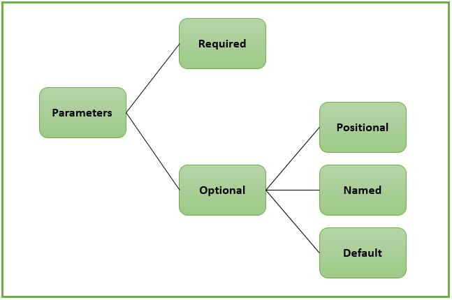

# Dart Functions

Functions in Dart are similar to functions in C and C++, but Dart adds features such as named parameters, optional parameters, and first-class function support. In a Dart file, execution usually starts from the `main` function.

```dart
void main() {
	print('Hello');
}
```

Dart also allows a shorter version when the return type is inferred:

```dart
main() {
	print('Hello');
}
```

For asynchronous code, `main` can return a `Future<void>`:

```dart
Future<void> main() async {
	await Future.delayed(Duration(seconds: 1));
	print('Async Hello');
}
```

When we need to repeat the same work in different parts of a program, we create our own functions.

## Basic Function Syntax

A function is declared with a return type, a name, parameters, and a body.

```dart
returnType functionName(parameters) {
	// body
	return value;
}
```

Example:

```dart
int add(int a, int b) {
	return a + b;
}
```

The return type tells us what the function gives back after execution. If a function does not return a value, we use `void`.

Examples:

```dart
void greet() {
	print('Hello!');
}
```

```dart
void show(String name, int age) {
	print('$name is $age years old');
}
```

```dart
double divide(double a, double b) {
	return a / b;
}
```

## Calling Functions

Here is a simple example of calling a function from `main`:

```dart
int add(int a, int b) {
	int result = a + b;
	return result;
}

void main() {
	var output = add(10, 20);
	print(output);
}
```

```dart
void hello() {
	print('Welcome to Dart Programming!');
}

void main() {
	hello();
}
```

## Parameters in Depth


Parameters define the input that a function accepts. In Dart, parameters can be positional or named.

### 1. Required Positional Parameters

These parameters are mandatory and must be passed in the correct order.

```dart
void greet(String name, int age) {
	print('Name: $name, Age: $age');
}

void main() {
	greet('Alice', 25);
}
```

Key points:

- Order matters.
- Every required parameter must be provided.
- This is the most direct form of function input.

### 2. Optional Positional Parameters

Optional positional parameters are placed inside square brackets `[]`. They can be skipped when calling the function.

```dart
void greet(String name, [int? age]) {
	print('Name: $name, Age: $age');
}

void main() {
	greet('Alice');
	greet('Bob', 30);
}
```

You can also provide a default value:

```dart
void greet(String name, [int age = 18]) {
	print('Name: $name, Age: $age');
}
```

Key points:

- Defined using `[]`.
- Order still matters.
- Optional parameters can be nullable.
- Default values make the function easier to use.

### 3. Named Parameters

Named parameters are defined inside curly braces `{}` and are passed by name.

```dart
void greet({String? name, int? age}) {
	print('Name: $name, Age: $age');
}

void main() {
	greet(name: 'Alice', age: 25);
}
```

Required named parameters use the `required` keyword:

```dart
void greet({required String name, required int age}) {
	print('Name: $name, Age: $age');
}
```

Key points:

- Defined using `{}`.
- Order does not matter.
- Named parameters improve readability.
- They can be optional or required.

| Type                | Syntax | Required          | Order Matters | Example Call       |
| ------------------- | ------ | ----------------- | ------------- | ------------------ |
| Positional          | `( )`  | Yes               | Yes           | `greet('A', 20)`   |
| Optional Positional | `[ ]`  | No                | Yes           | `greet('A')`       |
| Named               | `{ }`  | Optional/Required | No            | `greet(name: 'A')` |

In Flutter, named parameters are used frequently because UI code should be clear and readable.

## Function Types

Dart gives you multiple ways to write and use functions. The main forms are named functions, anonymous functions, and arrow functions.

### 1. Named Functions

Named functions are the standard functions with a name.

```dart
int add(int a, int b) {
	return a + b;
}
```

### 2. Anonymous Functions

An anonymous function is a function without a name. It is often used inline, especially in collections and callbacks.

Example:

```dart
var list = [1, 2, 3];

list.forEach((item) {
	print(item);
});
```

Here, `(item) {
	print(item);
}` is an anonymous function.

Anonymous functions are common in:

- Loops and collections
- Event handlers
- Callbacks in Flutter widgets

Example in a widget:

```dart
ElevatedButton(
	onPressed: () {
		print('Button clicked');
	},
	child: Text('Click'),
);
```

### 3. Arrow Functions

Arrow functions are a short form for functions that contain a single expression.

```dart
int square(int x) => x * x;
```

Use `=>` when the function only needs to return one expression. It keeps the code shorter and cleaner.

## Function as a Type and Use of Function

In Dart, `Function` is a type. It means "any function". You can use it when a variable, parameter, or return value should accept a function.

Example:

```dart
void execute(Function action) {
	action();
}

void main() {
	execute(() {
		print('Running...');
	});
}
```

This is useful when you want to pass behavior into another function. In Flutter, this idea appears often in callbacks such as `onPressed`, `onTap`, and `builder`.

You can also store a function in a variable:

```dart
Function sayHello = () {
	print('Hello from Function type');
};

void main() {
	sayHello();
}
```

For better readability, it is often better to use a more specific function type when possible:

```dart
void execute(void Function() action) {
	action();
}
```

Example with parameters and return value:

```dart
int operate(int a, int b, int Function(int, int) action) {
	return action(a, b);
}

void main() {
	print(operate(10, 5, (x, y) => x + y));
	print(operate(10, 5, (x, y) => x * y));
}
```

This shows how functions can be passed around like values and used to make code more flexible.
